# インタラクティブプレゼンテーション 要求仕様書

## 概要

このドキュメントは、AI-SDDワークフロー
デモプレゼンテーションにおけるインタラクティブなスライド表示機能の要求仕様を定義します。既存の10枚のスライド全体に対して、スライドナビゲーション強化、アニメーション・演出強化、聴衆参加型インタラクション、プレゼンター操作ツールの4つの機能領域を追加し、プレゼンテーションの伝達力と聴衆エンゲージメントを向上させることを目的とします。

### 背景

現在のプレゼンテーションはReveal.jsの基本機能によるスライド遷移とCSSアニメーションのみで構成されています。聴衆への情報伝達はプレゼンターの一方向的な説明に依存しており、聴衆参加やプレゼンター支援のための機能が不足しています。AI-SDDワークフローの価値をより効果的に伝えるために、インタラクティブな要素を導入します。

### 目的

- プレゼンテーションの操作性と視覚的な訴求力を向上させる
- 聴衆がリアルタイムで参加できる仕組みを提供する
- プレゼンターが効率的にプレゼンテーションを進行できるツールを提供する

---

# 1. 要求図の読み方

## 1.1. 要求タイプ

- **requirement**: 一般的な要求
- **functionalRequirement**: 機能要求
- **performanceRequirement**: パフォーマンス要求
- **interfaceRequirement**: インターフェース要求
- **designConstraint**: 設計制約

## 1.2. リスクレベル

- **High**: 高リスク（ビジネスクリティカル、実装困難）
- **Medium**: 中リスク（重要だが代替可能）
- **Low**: 低リスク（Nice to have）

## 1.3. 検証方法

- **Analysis**: 分析による検証
- **Test**: テストによる検証
- **Demonstration**: デモンストレーションによる検証
- **Inspection**: インスペクション（レビュー）による検証

## 1.4. 関係タイプ

- **contains**: 包含関係（親要求が子要求を含む）
- **derives**: 派生関係（要求から別の要求が導出される）
- **satisfies**: 満足関係（要素が要求を満たす）
- **verifies**: 検証関係（テストケースが要求を検証する）
- **refines**: 詳細化関係（要求をより詳細に定義する）
- **traces**: トレース関係（要求間の追跡可能性）

---

# 2. 要求一覧

## 2.1. ユースケース図（概要）

## 2.2. 機能一覧（テキスト形式）

- スライドナビゲーション強化
    - キーボード・タッチ操作によるスライド遷移
    - プログレスバーによる進捗表示
    - スライド番号表示
    - スライドオーバービュー（一覧表示）
    - URLハッシュによるスライド位置記憶
- アニメーション・演出強化
    - フラグメント表示（段階的コンテンツ表示）
    - スライドトランジション効果
    - コンテンツ出現アニメーション
    - スライド固有のビジュアルエフェクト
- 聴衆参加型インタラクション
    - リアルタイム投票・アンケート
    - Q&A（質問受付）機能
    - リアクション（絵文字・スタンプ）送信
- プレゼンター操作ツール
    - スピーカーノート表示
    - プレゼンテーションタイマー
    - レーザーポインター（カーソルハイライト）
    - スライドズーム機能

---

# 3. 要求図（SysML Requirements Diagram）

## 3.1. 全体要求図

## 3.2. スライドナビゲーション要求図

## 3.3. アニメーション・演出強化要求図

## 3.4. 聴衆参加型インタラクション要求図

## 3.5. プレゼンター操作ツール要求図

## 3.6. 非機能要求図

```mermaid
requirementDiagram
    performanceRequirement RenderPerformance {
        id: NFR_001
        text: "スライド遷移およびアニメーションが60fps以上で描画され、操作のラグが100ms以下であること"
        risk: medium
        verifymethod: test
    }

    interfaceRequirement BrowserCompatibility {
        id: NFR_002
        text: "主要ブラウザ（Chrome、Firefox、Safari、Edge の最新版）で正常に動作すること"
        risk: medium
        verifymethod: test
    }

    performanceRequirement ResponsiveDisplay {
        id: NFR_003
        text: "1280x720の基準解像度で最適表示し、異なる画面サイズでもコンテンツが正しく表示されること"
        risk: medium
        verifymethod: demonstration
    }

    designConstraint RevealJSCompatibility {
        id: NFR_004
        text: "Reveal.jsのDOM構造（.reveal > .slides > section）およびAPIとの互換性を維持すること"
        risk: high
        verifymethod: test
    }

    designConstraint TypeScriptStrict {
        id: NFR_005
        text: "TypeScript strictモードに準拠し、型安全性を確保すること"
        risk: medium
        verifymethod: test
    }
```

## 3.7. 要求間のトレーサビリティ

---

# 4. 要求の詳細説明

## 4.1. ユーザ要求

### UR_001: インタラクティブプレゼンテーション

プレゼンテーション資料をインタラクティブに表示し、プレゼンターと聴衆の双方が効果的にプレゼンテーションに関与できること。既存の10枚のスライド全体に対して、ナビゲーション強化、演出強化、聴衆参加、プレゼンター支援の4つの機能領域を追加し、AI-SDDワークフローの価値をより効果的に伝える。

**優先度:** Must

**検証方法:** デモンストレーションにより、全機能が統合的に動作することを確認

## 4.2. 機能要求

### FR_001: スライドナビゲーション強化

キーボード・タッチ操作によるスライド遷移、プログレスバー表示、スライド番号表示、オーバービュー表示、URLハッシュ同期を実現する。プレゼンターと聴衆がスライドの現在位置を常に把握でき、スムーズに任意のスライドへ移動できること。

**優先度:** Must

**検証方法:** テストおよびデモンストレーション

| サブ要求      | 優先度    | 説明                             |
|:----------|:-------|:-------------------------------|
| FR_001_01 | Must   | キーボードナビゲーション（矢印キー、Space、Enter） |
| FR_001_02 | Must   | タッチナビゲーション（スワイプ操作）             |
| FR_001_03 | Must   | プログレスバー・スライド番号表示               |
| FR_001_04 | Should | スライドオーバービュー表示                  |
| FR_001_05 | Should | URLハッシュ同期                      |

### FR_002: アニメーション・演出強化

スライドコンテンツの段階的表示（フラグメント）、スライド間トランジション効果、コンテンツ出現アニメーション、スライド固有のビジュアルエフェクトを実現する。視覚的な演出により、情報伝達を強化し聴衆の注目を維持する。

**優先度:** Must

**検証方法:** デモンストレーション

| サブ要求      | 優先度    | 説明                   |
|:----------|:-------|:---------------------|
| FR_002_01 | Must   | フラグメント表示（段階的コンテンツ表示） |
| FR_002_02 | Must   | スライドトランジション効果        |
| FR_002_03 | Should | コンテンツ出現アニメーション       |
| FR_002_04 | Should | スライド固有のビジュアルエフェクト    |

### FR_003: 聴衆参加型インタラクション

リアルタイム投票・アンケート、Q&A機能、リアクション送信を実現する。聴衆がプレゼンテーション中にフィードバックを提供し、双方向のコミュニケーションを可能にする。

**優先度:** Should

**検証方法:** デモンストレーション

| サブ要求      | 優先度    | 説明                 |
|:----------|:-------|:-------------------|
| FR_003_01 | Should | リアルタイム投票・アンケート     |
| FR_003_02 | Could  | Q&A（質問受付）機能        |
| FR_003_03 | Could  | リアクション（絵文字・スタンプ）送信 |

### FR_004: プレゼンター操作ツール

スピーカーノート表示、プレゼンテーションタイマー、レーザーポインター、スライドズーム機能を実現する。プレゼンターがプレゼンテーション中に効率的に進行を管理できるようにする。

**優先度:** Should

**検証方法:** デモンストレーション

| サブ要求      | 優先度    | 説明                   |
|:----------|:-------|:---------------------|
| FR_004_01 | Should | スピーカーノート表示           |
| FR_004_02 | Should | プレゼンテーションタイマー        |
| FR_004_03 | Could  | レーザーポインター（カーソルハイライト） |
| FR_004_04 | Could  | スライドズーム機能            |

## 4.3. 非機能要求

### NFR_001: 描画パフォーマンス

スライド遷移およびアニメーションが60fps以上で描画され、操作に対するレスポンスが100ms以下であること。ユーザーの操作に対してスムーズなフィードバックを提供する。

**優先度:** Must

**検証方法:** テスト（パフォーマンス計測）

### NFR_002: ブラウザ互換性

Chrome、Firefox、Safari、Edgeの最新版で正常に動作すること。各ブラウザのCSS・JavaScript仕様の差異を考慮した実装を行う。

**優先度:** Must

**検証方法:** テスト（ブラウザテスト）

### NFR_003: レスポンシブ表示

1280x720の基準解像度で最適表示し、Reveal.jsのスケーリング機能により異なる画面サイズでもコンテンツが正しく表示されること。

**優先度:** Must

**検証方法:** デモンストレーション

### NFR_004: Reveal.js互換性

Reveal.jsのDOM構造（`.reveal > .slides > section`）およびAPIとの互換性を維持すること。カスタム機能の追加がReveal.jsの既存機能を破壊しないこと。

**優先度:** Must

**検証方法:** テスト

### NFR_005: TypeScript Strict準拠

TypeScript strictモードに準拠し、`any`型の使用を避け、型安全性を確保すること。

**優先度:** Must

**検証方法:** テスト（ビルド時型チェック）

---

# 5. 制約事項

## 5.1. 技術的制約

- Reveal.jsのプラグインエコシステムおよびAPIの制約内で実装すること
- React + TypeScript + Viteの技術スタックを維持すること
- CSSスタイリングにおいてCSS Modules（スライド固有スタイル）とグローバルCSS（共通スタイル）の使い分けを維持すること

## 5.2. ビジネス的制約

- 既存の10枚のスライドの内容（テキスト・構成）を変更しないこと
- AI-SDDワークフローの価値提案を損なわないこと
- プレゼンテーション品質（1280x720での表示品質）を維持すること

---

# 6. 前提条件

- Node.js環境が利用可能であること
- 聴衆参加型機能（FR_003）はネットワーク接続が前提となる可能性がある
- プレゼンターと聴衆が同じURLにアクセスできる環境であること（聴衆参加型機能の場合）
- Reveal.jsの現行バージョンが上記機能をサポートしていること

---

# 7. スコープ外

以下は本PRDのスコープ外とします：

- スライド内容（テキスト・メッセージ）の変更
- 新しいスライドの追加
- プレゼンテーションの多言語対応
- モバイルアプリとしてのネイティブ対応
- プレゼンテーションの録画・再生機能
- ユーザー認証・アクセス制御

---

# 8. 用語集

| 用語        | 定義                                     |
|:----------|:---------------------------------------|
| フラグメント    | Reveal.jsの機能で、スライド内のコンテンツを段階的に表示する仕組み  |
| オーバービュー   | 全スライドを縮小表示して一覧する機能                     |
| スピーカーノート  | プレゼンター用のメモ。聴衆には表示されない補足情報              |
| トランジション   | スライド間の遷移時に適用される視覚効果（スライド、フェード等）        |
| レーザーポインター | カーソル位置をハイライト表示し、注目箇所を示す機能              |
| リアクション    | 聴衆が送信する絵文字やスタンプによるフィードバック              |
| MoSCoW法   | Must/Should/Could/Won'tの4段階で優先度を分類する手法 |
