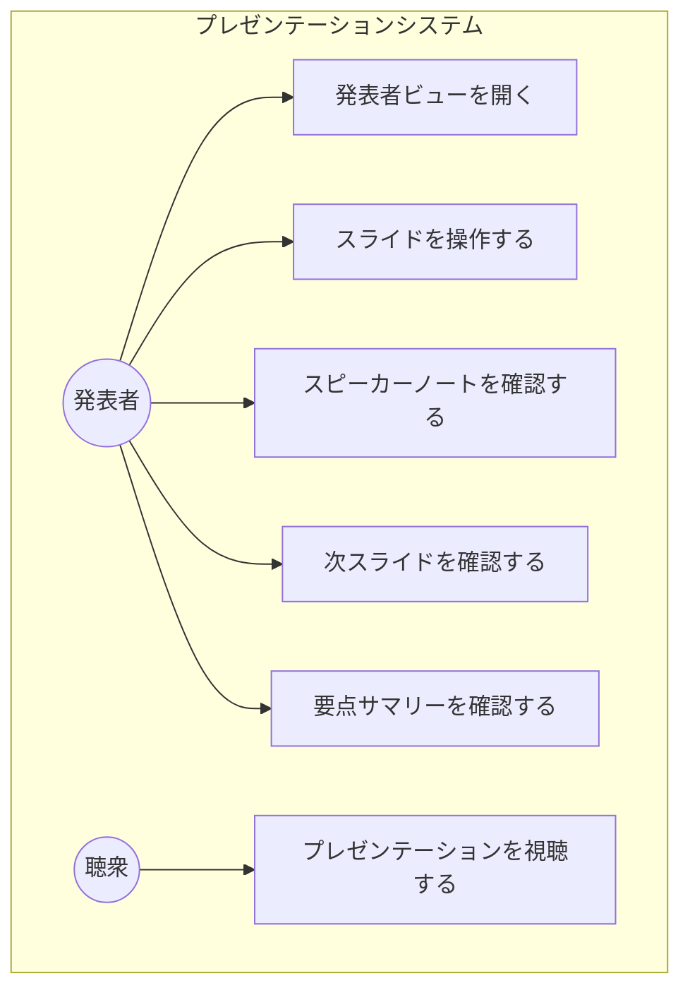

# 発表者ビュー（Presenter View）要求仕様書

## 概要

本ドキュメントは、プレゼンテーション実行時に発表者が参照するための「発表者ビュー」機能の要求を定義する。発表者ビューは別ウィンドウで表示され、スピーカーノート・次スライドのプレビュー・スライドの要点サマリーを含み、メインウィンドウのスライド進行に同期して表示が切り替わる。

---

# 1. 要求図の読み方

## 1.1. 要求タイプ

- **requirement**: 一般的な要求
- **functionalRequirement**: 機能要求
- **interfaceRequirement**: インターフェース要求
- **designConstraint**: 設計制約

## 1.2. リスクレベル

- **High**: 高リスク（ビジネスクリティカル、実装困難）
- **Medium**: 中リスク（重要だが代替可能）
- **Low**: 低リスク（Nice to have）

## 1.3. 検証方法

- **Analysis**: 分析による検証
- **Test**: テストによる検証
- **Demonstration**: デモンストレーションによる検証
- **Inspection**: インスペクション（レビュー）による検証

## 1.4. 関係タイプ

- **contains**: 包含関係（親要求が子要求を含む）
- **derives**: 派生関係（要求から別の要求が導出される）
- **refines**: 詳細化関係（要求をより詳細に定義する）

---

# 2. 要求一覧

## 2.1. ユースケース図（概要）

## 2.2. 機能一覧（テキスト形式）

- 発表者ビューウィンドウ
    - 別ウィンドウで発表者ビューを開く
    - ウィンドウ間のスライド進行同期
- スピーカーノート表示
    - 現在のスライドに紐づくノートを表示
    - slides.json の notes フィールドからデータ取得
- 次スライドプレビュー
    - 次のスライドのサムネイル/プレビューを表示
    - 最終スライドでは「最後のスライドです」等を表示
- スライド要点サマリー
    - 現在のスライドの要点を箇条書きで表示

---

# 3. 要求図（SysML Requirements Diagram）

## 3.1. 全体要求図

```mermaid
requirementDiagram
    requirement PresenterView {
        id: UR_PV_001
        text: "発表者が別ウィンドウでスピーカーノート・次スライドプレビュー・要点サマリーを確認でき、スライド進行に同期して表示が切り替わること"
        risk: high
        verifymethod: demonstration
    }

    functionalRequirement OpenPresenterWindow {
        id: FR_PV_001
        text: "発表者がUI操作により別ウィンドウで発表者ビューを開けること"
        risk: high
        verifymethod: demonstration
    }

    functionalRequirement SlideSynchronization {
        id: FR_PV_002
        text: "メインウィンドウでのスライド遷移が発表者ビューウィンドウにリアルタイムで同期されること"
        risk: high
        verifymethod: test
    }

    functionalRequirement SpeakerNotesDisplay {
        id: FR_PV_003
        text: "現在のスライドに紐づくスピーカーノートが発表者ビューに表示されること"
        risk: high
        verifymethod: test
    }

    functionalRequirement NextSlidePreview {
        id: FR_PV_004
        text: "次のスライドのプレビューが発表者ビューに表示されること"
        risk: medium
        verifymethod: demonstration
    }

    functionalRequirement SlideSummaryDisplay {
        id: FR_PV_005
        text: "現在のスライドの要点サマリーが発表者ビューに箇条書きで表示されること"
        risk: medium
        verifymethod: demonstration
    }

    functionalRequirement NotesDataInSlidesJson {
        id: FR_PV_006
        text: "スピーカーノートデータが slides.json の各スライドの notes フィールドとして定義できること"
        risk: high
        verifymethod: test
    }

    designConstraint DataDrivenNotes {
        id: DC_PV_001
        text: "スピーカーノートはJSONデータ駆動で管理し、データ駆動型スライドアーキテクチャ（A-003）に準拠すること"
        risk: low
        verifymethod: inspection
    }

    designConstraint FallbackOnNoNotes {
        id: DC_PV_002
        text: "ノートが未定義のスライドでは空欄またはデフォルトメッセージを表示し、フォールバックファースト設計（A-005）に準拠すること"
        risk: low
        verifymethod: test
    }

    PresenterView - contains -> OpenPresenterWindow
    PresenterView - contains -> SlideSynchronization
    PresenterView - contains -> SpeakerNotesDisplay
    PresenterView - contains -> NextSlidePreview
    PresenterView - contains -> SlideSummaryDisplay
    PresenterView - contains -> NotesDataInSlidesJson
    PresenterView - contains -> DataDrivenNotes
    PresenterView - contains -> FallbackOnNoNotes

    SpeakerNotesDisplay - derives -> NotesDataInSlidesJson
    SlideSummaryDisplay - derives -> NotesDataInSlidesJson
```

---

# 4. 要求の詳細説明

## 4.1. 機能要求

### FR-PV-001: 発表者ビューウィンドウの起動

発表者がプレゼンテーション画面上のUI操作（ボタンクリック等）により、別ウィンドウとして発表者ビューを開くことができる。メインウィンドウは聴衆向けのプレゼンテーション表示を継続する。

**優先度:** Must

**検証方法:** デモンストレーションによる検証

### FR-PV-002: スライド進行の同期

メインウィンドウでスライドを進める・戻す操作を行った場合、発表者ビューウィンドウの表示内容（スピーカーノート、次スライドプレビュー、要点サマリー）がリアルタイムで同期して切り替わる。

**優先度:** Must

**検証方法:** テストによる検証

### FR-PV-003: スピーカーノート表示

現在表示中のスライドに紐づくスピーカーノート（発表者メモ・台本）が、発表者ビュー内に読みやすい形式で表示される。

**優先度:** Must

**検証方法:** テストによる検証

### FR-PV-004: 次スライドプレビュー

発表者ビューに、次に表示されるスライドのプレビュー（サムネイルまたは縮小表示）を表示する。最終スライド表示時には、最後のスライドであることが分かる表示を行う。

**優先度:** Should

**検証方法:** デモンストレーションによる検証

### FR-PV-005: スライド要点サマリー表示

現在のスライドの要点を箇条書き形式でサマリーとして発表者ビューに表示する。このデータも slides.json のデータから取得する。

**優先度:** Should

**検証方法:** デモンストレーションによる検証

### FR-PV-006: slides.json での notes フィールド対応

各スライドのデータ定義（slides.json）に notes フィールドを追加可能とし、スピーカーノートや要点サマリーのデータをJSONデータとして管理できるようにする。

**優先度:** Must

**検証方法:** テストによる検証

## 4.2. 設計制約

### DC-PV-001: データ駆動型ノート管理

スピーカーノートはデータ駆動型スライドアーキテクチャ（CONSTITUTION.md A-003）に従い、slides.json のデータとして定義する。ハードコードは禁止する。

### DC-PV-002: ノート未定義時のフォールバック

ノートが定義されていないスライドでは、エラーを発生させずに空欄またはデフォルトメッセージを表示する（CONSTITUTION.md A-005 準拠）。

---

# 5. 制約事項

## 5.1. 技術的制約

- Reveal.js の DOM 構造（`.reveal > .slides > section`）との互換性を維持すること（T-002 準拠）
- TypeScript strict モードで型安全性を確保すること（T-001 準拠）
- 外部ライブラリのライフサイクルは useEffect で管理すること（T-003 準拠）
- ウィンドウ間通信のライフサイクルは useEffect で管理し、クリーンアップ時にリスナーを解除すること（T-003 準拠）
- 発表者ビューのスタイリングは3層モデルに従い、テーマカラーは CSS変数（`--theme-*`）経由で参照すること（A-002 準拠）
- slides.json の notes フィールドはバリデーションを実施し、型安全性を保証すること（D-002 準拠）
- 発表者ビューのUIコンポーネントは ComponentRegistry で管理し、拡張性を確保すること（A-004 準拠）

## 5.2. ビジネス的制約

- プレゼンテーションの視覚的品質と伝達力を損なわないこと（B-001 準拠）
- スピーカーノートや要点サマリーの内容がAI-SDDワークフローの実際の機能と一致していること（B-002 準拠）

---

# 6. 前提条件

- メインウィンドウでプレゼンテーションが正常に動作していること
- ブラウザが window.open() によるポップアップウィンドウを許可していること
- slides.json にスライドデータが定義されていること

---

# 7. スコープ外

以下は本PRDのスコープ外とします：

- 発表者ビューからのスライド操作（リモコン的な機能）
- タイマー・経過時間の表示
- 聴衆側のリアルタイムQ&A機能
- 発表者ビューのカスタムテーマ設定

---

# 8. 用語集

| 用語 | 定義 |
|------|------|
| 発表者ビュー（Presenter View） | 発表者が参照するための別ウィンドウ。スピーカーノート、次スライドプレビュー、要点サマリーを含む |
| スピーカーノート（Speaker Notes） | 各スライドに紐づく発表者用のメモ・台本テキスト |
| 要点サマリー（Slide Summary） | 各スライドの要点を箇条書きにまとめたもの |
| 次スライドプレビュー（Next Slide Preview） | 次に遷移するスライドの縮小表示 |
| スライド同期（Slide Synchronization） | メインウィンドウと発表者ビューウィンドウ間でスライド位置を一致させる仕組み |
