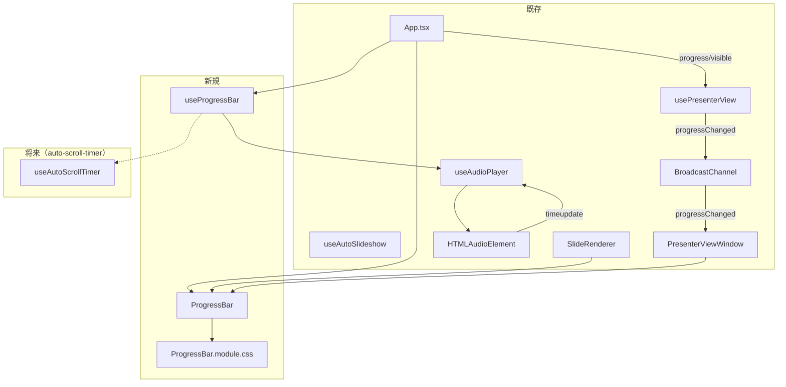

# 自動スクロールプログレスバー（Auto Scroll Progress Bar）

**ドキュメント種別:** 技術設計書 (Design Doc)
**SDDフェーズ:** Plan (計画/設計)
**最終更新日:** 2026-02-01
**関連 Spec:** [auto-scroll-progress-bar_spec.md](./auto-scroll-progress-bar_spec.md)
**関連 PRD:** [auto-scroll-progress-bar.md](../requirement/auto-scroll-progress-bar.md)

---

# 1. 実装ステータス

**ステータス:** 🔴 未実装

## 1.1. 実装進捗

| モジュール/機能                | ステータス | 備考                                                    |
|-------------------------|-------|-------------------------------------------------------|
| useProgressBar フック      | 🔴    | 進行率算出ロジック                                             |
| ProgressBar コンポーネント     | 🔴    | UI表示                                                  |
| useAudioPlayer への進行情報追加 | 🔴    | currentTime/duration の公開                              |
| App.tsx への統合            | 🔴    | フック呼び出しとコンポーネント配置                                     |
| 発表者ビューへの統合              | 🔴    | BroadcastChannel 経由の進行状況同期 + PresenterViewWindow への配置 |

---

# 2. 設計目標

1. **既存アーキテクチャとの一貫性**: 既存の `useAudioPlayer`、`useAutoSlideshow` フックのパターンに従い、プログレスバーのロジックをカスタムフックとして分離する
2. **最小限の変更**: 既存コードへの変更を最小限にし、主に新規ファイルの追加で実現する
3. **タイマー機能との独立性**: タイマーベース自動スクロール（auto-scroll-timer）は別途実装予定のため、タイマープログレスの入力インターフェースのみ定義し、具体的なタイマー実装には依存しない
4. **テーマ統合**: CSS変数を活用し、テーマカラーとの統一感を保つ（A-002 準拠）
5. **デュアルビュー対応**: メインウィンドウと発表者ビューの両方でプログレスバーを表示し、既存の BroadcastChannel
   通信パターンに従って進行状況を同期する

---

# 3. 技術スタック

| 領域      | 採用技術                             | 選定理由                                                      |
|---------|----------------------------------|-----------------------------------------------------------|
| UI      | React コンポーネント                    | 既存のコンポーネントアーキテクチャに準拠（A-001）                               |
| ロジック    | React カスタムフック                    | 既存の useAudioPlayer, useAutoSlideshow パターンとの一貫性            |
| アニメーション | CSS transition                   | requestAnimationFrame より宣言的でシンプル。滑らかなアニメーションが CSS だけで実現可能 |
| スタイリング  | CSS Modules                      | コンポーネント固有スタイルの管理（A-002 の3層モデル準拠）                          |
| 音声進行取得  | HTMLAudioElement timeupdate イベント | 既存の useAudioPlayer が内部で管理する Audio 要素から進行情報を取得             |

---

# 4. アーキテクチャ

## 4.1. システム構成図



## 4.2. モジュール分割

| モジュール名                 | 責務             | 依存関係                | 配置場所                                  |
|------------------------|----------------|---------------------|---------------------------------------|
| useProgressBar         | 進行率の算出と表示状態の管理 | useAudioPlayer の戻り値 | src/hooks/useProgressBar.ts           |
| ProgressBar            | プログレスバーの描画     | なし（props のみ）        | src/components/ProgressBar.tsx        |
| ProgressBar.module.css | プログレスバーのスタイル定義 | CSS変数（--theme-*）    | src/components/ProgressBar.module.css |

## 4.3. 既存コードへの変更

| 対象ファイル                                 | 変更内容                                                 | 理由                       |
|----------------------------------------|------------------------------------------------------|--------------------------|
| src/hooks/useAudioPlayer.ts            | `currentTime` と `duration` を戻り値に追加                   | 音声再生の進行情報をプログレスバーに提供するため |
| src/App.tsx                            | useProgressBar フックの呼び出しと ProgressBar コンポーネントの配置      | プログレスバーの統合               |
| src/hooks/usePresenterView.ts          | `PresenterViewMessage` に `progressChanged` メッセージ型を追加 | 発表者ビューへの進行状況同期           |
| src/components/PresenterViewWindow.tsx | コントロールバー直下に ProgressBar コンポーネントを配置                   | 発表者ビューでのプログレスバー表示        |

---

# 5. データモデル

```typescript
/** useAudioPlayer の戻り値への追加 */
interface UseAudioPlayerReturn {
  // 既存フィールド
  playbackState: AudioPlaybackState
  play: (src: string) => void
  stop: () => void
  isPlaying: boolean
  onEndedRef: React.MutableRefObject<(() => void) | null>
  // 追加フィールド
  currentTime: number   // 現在の再生位置（秒）
  duration: number      // 音声の総時間（秒）
}
```

---

# 6. インターフェース定義

```typescript
/** useProgressBar フック */
function useProgressBar(options: UseProgressBarOptions): UseProgressBarReturn {
}

/** ProgressBar コンポーネント */
function ProgressBar(props: ProgressBarProps): JSX.Element | null {
}
```

---

# 7. 非機能要件実現方針

| 要件                       | 実現方針                                                 |
|--------------------------|------------------------------------------------------|
| 滑らかなアニメーション（FR-ASPB-004） | CSS `transition: width` を使用し、ブラウザのレンダリングエンジンに最適化を委ねる |
| コンテンツ非干渉（DC_ASPB_002）    | `position: absolute; bottom: 0` で配置し、高さは 3px に制限     |
| テーマ統合（DC_ASPB_001）       | バーの色に `var(--theme-primary)` を使用                     |
| ライフサイクル管理（DC_ASPB_003）   | useEffect のクリーンアップで timeupdate イベントリスナーを解除           |

---

# 8. テスト戦略

| テストレベル  | 対象                  | カバレッジ目標                           |
|---------|---------------------|-----------------------------------|
| ユニットテスト | useProgressBar フック  | 進行率算出ロジック（audio/timer/none の各ケース） |
| ユニットテスト | ProgressBar コンポーネント | 表示/非表示切替、progress 値の反映            |
| ユニットテスト | useAudioPlayer 拡張   | currentTime/duration の正しい値返却      |

---

# 9. 設計判断

## 9.1. 決定事項

| 決定事項                   | 選択肢                                                            | 決定内容                    | 理由                                                                                                                                 |
|------------------------|----------------------------------------------------------------|-------------------------|------------------------------------------------------------------------------------------------------------------------------------|
| アニメーション方式              | (a) CSS transition (b) requestAnimationFrame (c) CSS animation | (a) CSS transition      | 宣言的でシンプル。width プロパティの変化を transition で滑らかに補間するだけで十分。ブラウザ最適化の恩恵を受けられる                                                                |
| 音声進行の取得方法              | (a) useAudioPlayer を拡張 (b) 別途 Audio 参照を取得                      | (a) useAudioPlayer を拡張  | 既存の Audio 要素管理の一元化を維持（A-001 準拠）。currentTime/duration を戻り値に追加するだけの最小変更                                                              |
| スタイリング方式               | (a) CSS Modules (b) MUI sx prop (c) インラインスタイル                  | (a) CSS Modules         | コンポーネント固有の複雑なスタイル（position, transition, opacity）を管理するため、A-002 の3層モデルに従い CSS Modules を採用                                            |
| タイマープログレスの対応方針         | (a) タイマー実装を含める (b) インターフェースのみ定義                                | (b) インターフェースのみ定義        | タイマーベース自動スクロール（auto-scroll-timer）は別PRDで実装予定。プログレスバーは TimerProgress インターフェースを受け取る設計にし、タイマー実装時にそのまま接続可能にする                           |
| ProgressBar の配置場所（メイン） | (a) 各 section 内 (b) .reveal の直下 (c) SlideRenderer 内            | (a) 各 section 内         | Reveal.js の DOM 構造（T-002）を尊重し、各スライドの section 要素内に配置。スライド遷移アニメーションと自然に連動する                                                          |
| 発表者ビューでの配置場所           | (a) コントロールバー下部 (b) ウィンドウ最下部 (c) プレビュー内                         | (a) コントロールバー下部          | 発表者が視線を大きく動かさずにプログレスを確認可能。コントロールバーのナビゲーション・音声コントロールと一体感のあるUIを実現                                                                    |
| 発表者ビューへの同期方式           | (a) BroadcastChannel 経由 (b) 発表者ビュー側で独立に算出                      | (a) BroadcastChannel 経由 | 既存の usePresenterView の通信パターン（BroadcastChannel `'presenter-view'`）に従う。メインウィンドウで算出した progress/visible を送信し、発表者ビューは受信して表示するだけのシンプルな構成 |

## 9.2. 未解決の課題

| 課題                      | 影響度 | 対応方針                                                                                                    |
|-------------------------|-----|---------------------------------------------------------------------------------------------------------|
| タイマープログレスの具体的な進行情報の取得方法 | 中   | auto-scroll-timer の設計書で決定。useProgressBar は TimerProgress インターフェースに依存するため、タイマー側がこのインターフェースに適合する値を提供すればよい |
