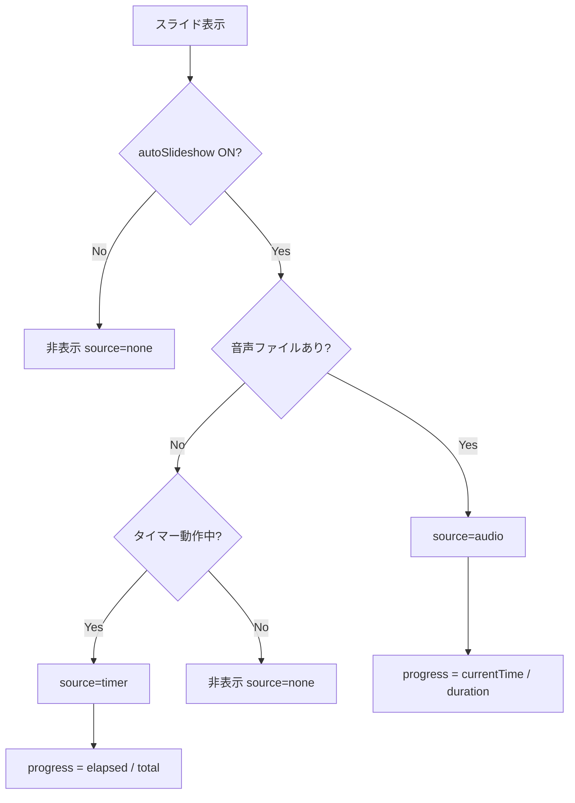
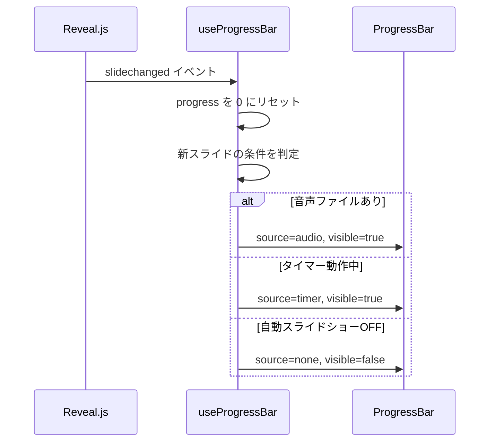
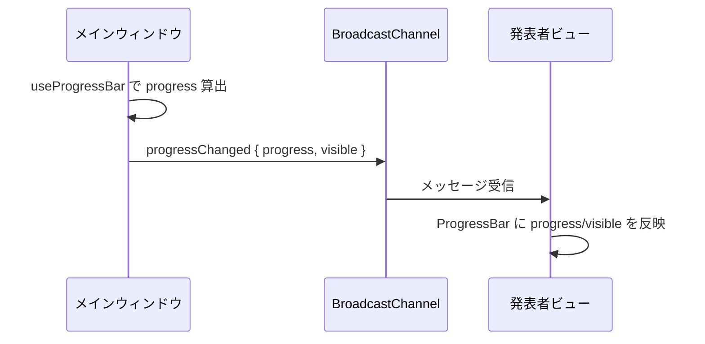

# 自動スクロールプログレスバー（Auto Scroll Progress Bar）

**ドキュメント種別:** 抽象仕様書 (Spec)
**SDDフェーズ:** Specify (仕様化)
**最終更新日:** 2026-02-01
**関連 Design Doc:** [auto-scroll-progress-bar_design.md](./auto-scroll-progress-bar_design.md)
**関連 PRD:** [auto-scroll-progress-bar.md](../requirement/auto-scroll-progress-bar.md)

---

# 1. 背景

プレゼンテーションの自動スクロール機能（音声再生トリガーおよびタイマーベース）では、発表者と聴衆が「いつ次のスライドに切り替わるのか」を把握する手段がない。これにより、発表者はスライド遷移のタイミングを予測できず、聴衆もコンテンツの読了ペースを調整しにくい状況が生じる。

メインウィンドウのスライド下部および発表者ビューのコントロールバー下部にプログレスバーを表示し、自動スクロールの進行状況を視覚的に示すことで、発表者と聴衆の双方が次スライドへの遷移タイミングを直感的に把握できるようにする。

# 2. 概要

自動スクロールプログレスバーは、自動スライドショーの進行状況を左から右に伸びるバーで可視化するUI要素である。

**設計原則:**

- **2つの進行モード**: 音声再生の進行に連動するモードと、タイマーの経過に連動するモードを提供する
- **非干渉**: スライドコンテンツの視認性・伝達力を損なわない補助的なUI要素として機能する
- **状態連動**: 自動スライドショーのON/OFF状態に連動し、OFFの場合は非表示とする
- **デュアルビュー**: メインウィンドウと発表者ビューの両方にプログレスバーを表示し、同一の進行状況を同期する

# 3. 要求定義

## 3.1. 機能要件 (Functional Requirements)

| ID          | 要件                                                      | 優先度 | 根拠                                 |
|-------------|---------------------------------------------------------|-----|------------------------------------|
| FR-ASPB-001 | 音声ファイル再生中に、再生開始から終了までの進行をプログレスバーで左から右に可視化する             | 必須  | PRD FR_ASPB_001: 音声再生の進行状況を可視化     |
| FR-ASPB-002 | タイマーベース自動スクロール中に、スライド表示から設定時間経過までの進行をプログレスバーで左から右に可視化する | 必須  | PRD FR_ASPB_002: タイマー進行の可視化        |
| FR-ASPB-003 | プログレスバーをスライドの下部に細いバー（高さ3-4px程度）として表示する                  | 推奨  | PRD FR_ASPB_003: スライドコンテンツと重ならない配置 |
| FR-ASPB-004 | プログレスバーが左端（0%）から右端（100%）へ滑らかなアニメーションで伸びる                | 推奨  | PRD FR_ASPB_004: 視覚的に自然な進行表現       |
| FR-ASPB-005 | 自動スライドショーがOFFの場合、プログレスバーを非表示にする                         | 推奨  | PRD FR_ASPB_005: 不要時の非表示           |
| FR-ASPB-006 | スライド切替時にプログレスバーを0%にリセットし、新しいスライドの条件に応じて再開する             | 推奨  | PRD FR_ASPB_006: スライド遷移時のリセット      |
| FR-ASPB-007 | 発表者ビューのコントロールバー下部に、メインウィンドウと同じ進行状況のプログレスバーを表示する         | 推奨  | PRD FR_ASPB_007: 発表者ビューでの進行確認      |

# 4. API

## 4.1. 公開API一覧

| ディレクトリ          | ファイル名             | エクスポート           | 概要                      |
|-----------------|-------------------|------------------|-------------------------|
| src/hooks/      | useProgressBar.ts | `useProgressBar` | プログレスバーの進行率を算出するカスタムフック |
| src/components/ | ProgressBar.tsx   | `ProgressBar`    | プログレスバーUI表示コンポーネント      |

## 4.2. 型定義

```typescript
/** プログレスバーの進行ソース種別 */
type ProgressSource = 'audio' | 'timer' | 'none'

/** プログレスバーフックの入力 */
interface UseProgressBarOptions {
  /** 自動スライドショーが有効か */
  autoSlideshow: boolean
  /** 現在のスライドに音声ファイルがあるか */
  hasVoice: boolean
  /** 音声プレイヤーの状態（再生状態、currentTime、duration） */
  audioProgress: AudioProgress | null
  /** タイマーの進行情報（経過時間、総時間） */
  timerProgress: TimerProgress | null
}

/** 音声再生の進行情報 */
interface AudioProgress {
  /** 現在の再生位置（秒） */
  currentTime: number
  /** 音声の総時間（秒） */
  duration: number
}

/** タイマーの進行情報 */
interface TimerProgress {
  /** 経過時間（秒） */
  elapsed: number
  /** 設定された総時間（秒） */
  total: number
}

/** プログレスバーフックの出力 */
interface UseProgressBarReturn {
  /** 進行率（0.0〜1.0） */
  progress: number
  /** 現在の進行ソース */
  source: ProgressSource
  /** プログレスバーを表示するか */
  visible: boolean
}

/** プログレスバーコンポーネントのプロパティ */
interface ProgressBarProps {
  /** 進行率（0.0〜1.0） */
  progress: number
  /** 表示/非表示 */
  visible: boolean
}
```

# 5. 用語集

| 用語                        | 説明                                    |
|---------------------------|---------------------------------------|
| プログレスバー（Progress Bar）     | 自動スクロールの進行状況を左から右に伸びるバーで可視化するUI要素     |
| 音声プログレス（Audio Progress）   | 音声ファイル再生の進行に基づくプログレスバーの表示モード          |
| タイマープログレス（Timer Progress） | タイマーベース自動スクロールの進行に基づくプログレスバーの表示モード    |
| スクロールスピード（Scroll Speed）   | 音声未定義スライドで次スライドへ自動遷移するまでの待機時間（秒）      |
| 進行ソース（Progress Source）    | プログレスバーの進行率を決定する情報源（audio/timer/none） |

# 6. 使用例

## 6.1. メインウィンドウでの使用

```tsx
import { useProgressBar } from '../hooks/useProgressBar'
import { ProgressBar } from './ProgressBar'

function SlideWithProgressBar() {
  const { progress, visible } = useProgressBar({
    autoSlideshow: true,
    hasVoice: true,
    audioProgress: { currentTime: 15, duration: 30 },
    timerProgress: null,
  })

  return (
    <section>
      {/* スライドコンテンツ */}
      <ProgressBar progress={progress} visible={visible} />
    </section>
  )
}
```

## 6.2. 発表者ビューでの使用

```tsx
import { ProgressBar } from './ProgressBar'

function PresenterViewWindow({ progress, visible }) {
  return (
    <div className={styles.container}>
      {/* コントロールバー（ナビゲーション、音声コントロール） */}
      <div className={styles.controlBar}>{/* ... */}</div>
      {/* プログレスバー（コントロールバー直下） */}
      <ProgressBar progress={progress} visible={visible} />
      {/* メインコンテンツ */}
      <div className={styles.mainContent}>{/* ... */}</div>
    </div>
  )
}
```

# 7. 振る舞い図

## 7.1. 進行ソース判定フロー



## 7.2. スライド遷移時のリセット



## 7.3. 発表者ビューへの進行状況同期



# 8. 制約事項

- プログレスバーのスタイリングはCSS変数（`--theme-*`）を使用すること（CONSTITUTION A-002 準拠）
- プログレスバーはスライドコンテンツの視認性を損なわないこと（CONSTITUTION B-001 準拠）
- アニメーション・タイマーのライフサイクルは useEffect で管理すること（CONSTITUTION T-003 準拠）
- TypeScript strict モードで型安全性を確保すること（CONSTITUTION T-001 準拠）
- Reveal.js の DOM 構造との互換性を維持すること（CONSTITUTION T-002 準拠）

---

## PRD参照

- 対応PRD: [auto-scroll-progress-bar.md](../requirement/auto-scroll-progress-bar.md)
- カバーする要求: UR_ASPB_001, FR_ASPB_001, FR_ASPB_002, FR_ASPB_003, FR_ASPB_004, FR_ASPB_005, FR_ASPB_006,
  FR_ASPB_007, DC_ASPB_001, DC_ASPB_002, DC_ASPB_003
