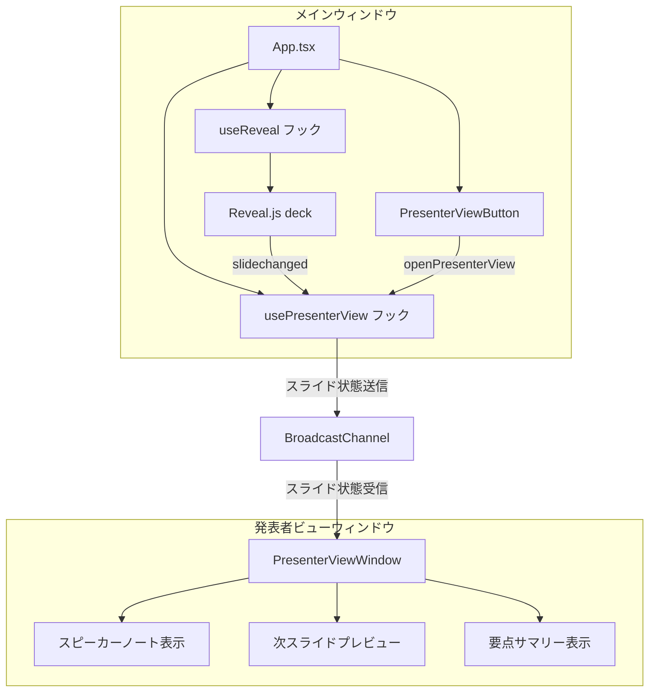

# 発表者ビュー（Presenter View）

**ドキュメント種別:** 技術設計書 (Design Doc)
**SDDフェーズ:** Plan (計画/設計)
**最終更新日:** 2026-01-31
**関連 Spec:** [presenter-view_spec.md](./presenter-view_spec.md)
**関連 PRD:** [presenter-view.md](../requirement/presenter-view.md)

---

# 1. 実装ステータス

**ステータス:** 🟢 実装完了

## 1.1. 実装進捗

| モジュール/機能 | ステータス | 備考 |
|---|---|---|
| notes フィールド型拡張 | 🟢 完了 | `SlideMeta.notes` を `string \| SlideNotes` に拡張。後方互換性維持 |
| useReveal フック拡張 | 🟢 完了 | `onSlideChanged` コールバック、`getCurrentSlide` メソッド追加 |
| ウィンドウ間通信 | 🟢 完了 | `usePresenterView` フック（BroadcastChannel） |
| 発表者ビューUI | 🟢 完了 | `PresenterViewWindow` コンポーネント（3パネル構成、CSS Modules） |
| 発表者ビュー起動ボタン | 🟢 完了 | `PresenterViewButton` コンポーネント |
| バリデーション拡張 | 🟢 完了 | `validateSlideNotes()` を `loader.ts` に追加 |
| notes ヘルパー関数 | 🟢 完了 | `normalizeNotes`, `getSpeakerNotes`, `getSlideSummary` |
| エントリーポイント | 🟢 完了 | `presenter-view.html` + `presenterViewEntry.tsx` |
| Vite マルチエントリー | 🟢 完了 | `vite.config.ts` に `rollupOptions.input` 追加 |

---

# 2. 設計目標

1. **データ駆動の維持** — ノートデータは slides.json で管理し、A-003 に準拠する
2. **既存コードへの影響最小化** — useReveal フックの拡張は後方互換性を維持する
3. **リソースの確実なクリーンアップ** — ウィンドウ間通信のライフサイクルを useEffect で管理し、T-003 に準拠する
4. **フォールバックファースト** — ノート未定義、ウィンドウブロック、通信エラー時にも安全に動作する（A-005 準拠）
5. **後方互換性** — 既存の `SlideMeta.notes: string` との互換性を `string | SlideNotes` のユニオン型で維持する

---

# 3. 技術スタック

| 領域 | 採用技術 | 選定理由 |
|---|---|---|
| ウィンドウ間通信 | BroadcastChannel API | 同一オリジンの複数ウィンドウ間でメッセージングが可能。SharedWorker より軽量でシンプル |
| ウィンドウ管理 | window.open() | ブラウザ標準のポップアップウィンドウAPI。別ウィンドウの生成に必要十分 |
| 発表者ビューUI | React + CSS Modules | 既存プロジェクトのスタイリング規約（A-002）に準拠。発表者ビューは独自のレイアウトを持つため CSS Modules が適切 |
| スライドイベント | Reveal.js `slidechanged` イベント | Reveal.js 標準のスライド変更イベント。deck インスタンスの `on()` メソッドで取得 |

---

# 4. アーキテクチャ

## 4.1. システム構成図



## 4.2. モジュール分割

| モジュール名 | 責務 | 依存関係 | 配置場所 |
|---|---|---|---|
| `useReveal` (拡張) | Reveal.js 初期化、スライド変更イベントのコールバック通知 | Reveal.js | `src/hooks/useReveal.ts` |
| `usePresenterView` | 発表者ビューウィンドウの管理、BroadcastChannel による同期 | useReveal | `src/hooks/usePresenterView.ts` |
| `PresenterViewButton` | 発表者ビューを開くUIボタン | usePresenterView | `src/components/PresenterViewButton.tsx` |
| `PresenterViewWindow` | 発表者ビューウィンドウのルートコンポーネント | BroadcastChannel | `src/components/PresenterViewWindow.tsx` |
| `presenter-view.html` | 発表者ビューウィンドウ用のHTMLエントリーポイント | - | `public/presenter-view.html` |
| `presenterViewEntry.tsx` | 発表者ビューウィンドウの React エントリーポイント | PresenterViewWindow | `src/presenterViewEntry.tsx` |
| 型定義拡張 | `SlideNotes` 型、`SlideMeta.notes` の型拡張 | - | `src/data/types.ts` |
| バリデーション拡張 | notes フィールドのバリデーション | - | `src/data/loader.ts` |

---

# 5. データモデル

## 5.1. notes フィールドの型拡張

```typescript
/** スライドのノート情報 */
interface SlideNotes {
  speakerNotes?: string
  summary?: string[]
}

/** 既存の SlideMeta を拡張 */
interface SlideMeta {
  transition?: string
  notes?: string | SlideNotes  // string（後方互換）または SlideNotes オブジェクト
  backgroundImage?: string
  backgroundColor?: string
}
```

## 5.2. ウィンドウ間通信メッセージ

```typescript
/** BroadcastChannel で送受信するメッセージ */
type PresenterViewMessage =
  | {
      type: 'slideChanged'
      payload: {
        currentIndex: number
        slides: SlideData[]
      }
    }
  | {
      type: 'presenterViewReady'
    }
  | {
      type: 'presenterViewClosed'
    }
```

---

# 6. インターフェース定義

## 6.1. useReveal フックの拡張

```typescript
interface UseRevealOptions {
  /** スライド変更時のコールバック */
  onSlideChanged?: (event: { indexh: number; indexv: number }) => void
}

/** 戻り値を拡張 */
interface UseRevealReturn {
  deckRef: React.RefObject<HTMLDivElement>
  /** 現在のスライドインデックスを取得 */
  getCurrentSlide: () => { indexh: number; indexv: number } | null
}

function useReveal(options?: UseRevealOptions): UseRevealReturn {}
```

## 6.2. usePresenterView フック

```typescript
interface UsePresenterViewOptions {
  slides: SlideData[]
}

interface UsePresenterViewReturn {
  openPresenterView: () => void
  isOpen: boolean
}

function usePresenterView(options: UsePresenterViewOptions): UsePresenterViewReturn {
}
```

---

# 7. 非機能要件実現方針

| 要件 | 実現方針 |
|---|---|
| スライド同期の即時性 | BroadcastChannel はイベント駆動のため、postMessage 即座に配信される。ポーリング不要 |
| ポップアップブロック対策 | window.open() がブロックされた場合はユーザーに許可を促すメッセージを表示 |
| ウィンドウクローズ時のクリーンアップ | `beforeunload` イベントと `useEffect` クリーンアップで BroadcastChannel を閉じる |
| 後方互換性 | `notes` フィールドが `string` の場合は `speakerNotes` として扱い、`summary` は空配列とする |

---

# 8. テスト戦略

| テストレベル | 対象 | カバレッジ目標 |
|---|---|---|
| ユニットテスト | notes フィールドの型判定・変換ロジック | `string` → `SlideNotes` 変換、未定義時のフォールバック |
| ユニットテスト | バリデーション拡張 | notes フィールドのバリデーション（string, SlideNotes, undefined, 不正値） |
| ユニットテスト | usePresenterView フック | ウィンドウ管理、BroadcastChannel メッセージ送受信 |
| 結合テスト | スライド変更 → ノート表示の同期 | メインウィンドウ操作 → 発表者ビュー更新の一連フロー |
| E2Eテスト | 発表者ビューの起動から操作まで | 手動デモンストレーションで検証 |

---

# 9. 設計判断

## 9.1. 決定事項

| 決定事項 | 選択肢 | 決定内容 | 理由 |
|---|---|---|---|
| ウィンドウ間通信方式 | (1) BroadcastChannel (2) SharedWorker (3) localStorage + storage event (4) postMessage | BroadcastChannel | 同一オリジン前提で最もシンプル。SharedWorker は過剰。localStorage は同期的でパフォーマンス懸念あり。postMessage は window 参照の管理が複雑 |
| 発表者ビューのレンダリング方式 | (1) 別エントリーポイント (2) 同一アプリ内の別ルート (3) iframe | 別エントリーポイント | 発表者ビューはメインプレゼンテーションと異なるUIを持つ。別エントリーポイントにすることでメインバンドルサイズへの影響を回避 |
| notes フィールドの型拡張 | (1) `string \| SlideNotes` ユニオン型 (2) 新しい別フィールド追加 (3) `SlideNotes` のみに変更 | `string \| SlideNotes` ユニオン型 | 既存の `notes?: string` との後方互換性を維持しつつ、構造化データも対応可能 |
| 次スライドプレビューの実装 | (1) スライドデータからHTMLを再レンダリング (2) スライドのサムネイル画像を生成 (3) スライドのテキスト情報のみ表示 | スライドデータからHTMLを再レンダリング | データ駆動型アーキテクチャ（A-003）と整合。SlideRenderer を縮小表示で再利用可能 |

## 9.2. 未解決の課題

| 課題 | 影響度 | 対応方針 |
|---|---|---|
| Vite のマルチエントリーポイント設定 | 中 | `vite.config.ts` で `build.rollupOptions.input` に発表者ビュー用エントリーを追加 |
| Reveal.js 型定義の拡張 | 低 | `reveal.d.ts` に `on()`, `getIndices()`, `getSlides()` メソッドの型を追加 |
| ポップアップブロッカーへの対応 | 中 | ユーザー操作（クリック）起点で `window.open()` を呼び出すことでブロックを回避。ブロック時はガイダンスを表示 |
