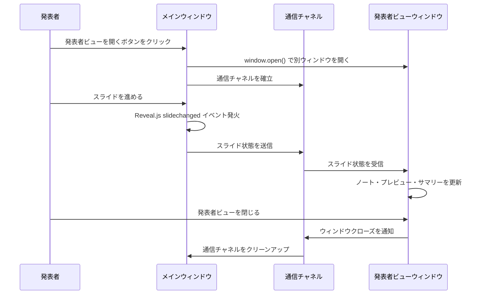
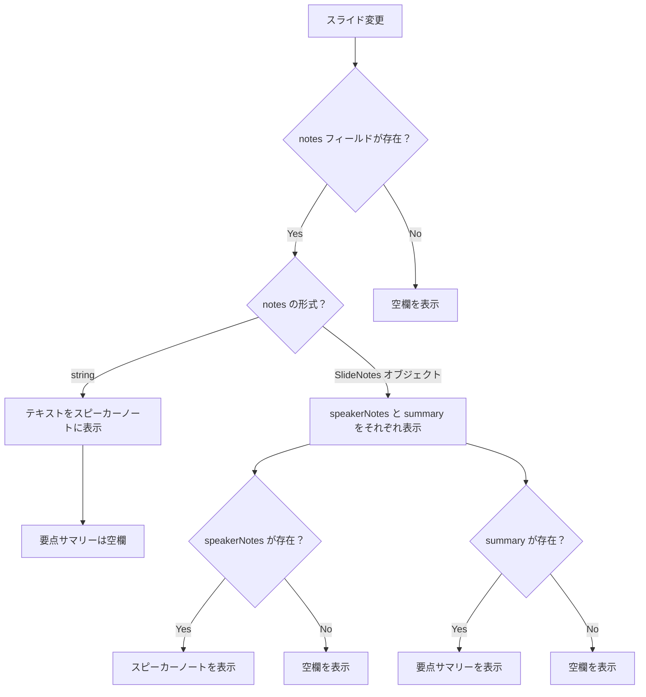

# 発表者ビュー（Presenter View）

**ドキュメント種別:** 抽象仕様書 (Spec)
**SDDフェーズ:** Specify (仕様化)
**最終更新日:** 2026-01-31
**関連 Design Doc:** [presenter-view_design.md](./presenter-view_design.md)
**関連 PRD:** [presenter-view.md](../requirement/presenter-view.md)

---

# 1. 背景

プレゼンテーション時に発表者はスライドの内容だけでなく、補足的な情報（スピーカーノート、次のスライド内容、要点の確認）を手元で参照する必要がある。現状のシステムでは聴衆と発表者が同一の画面を参照しており、発表者が台本やメモを確認する手段がない。

発表者ビュー機能は、メインプレゼンテーションとは別のウィンドウで発表者向けの情報を表示し、スライド進行に同期して表示を切り替えることで、発表の質を向上させる。

# 2. 概要

発表者ビューは、プレゼンテーション実行中に発表者が参照するための補助的なウィンドウである。以下の3つの情報を提供する。

1. **スピーカーノート** — 現在のスライドに紐づく発表者用のメモ・台本
2. **次スライドプレビュー** — 次に遷移するスライドの縮小表示
3. **要点サマリー** — 現在のスライドの要点の箇条書き

メインウィンドウでのスライド操作（進む・戻る）に同期して、発表者ビューの表示内容がリアルタイムで切り替わる。

# 3. 要求定義

## 3.1. 機能要件 (Functional Requirements)

| ID | 要件 | 優先度 | PRD参照 |
|---|---|---|---|
| FR-001 | 発表者がUI操作により別ウィンドウで発表者ビューを開ける | Must | FR-PV-001 |
| FR-002 | メインウィンドウでのスライド遷移が発表者ビューにリアルタイムで同期される | Must | FR-PV-002 |
| FR-003 | 現在のスライドに紐づくスピーカーノートが発表者ビューに表示される | Must | FR-PV-003 |
| FR-004 | 次のスライドのプレビューが発表者ビューに表示される | Should | FR-PV-004 |
| FR-005 | 現在のスライドの要点サマリーが箇条書きで表示される | Should | FR-PV-005 |
| FR-006 | slides.json の各スライドに notes フィールドを定義できる | Must | FR-PV-006 |
| FR-007 | ノートが未定義のスライドでは空欄またはデフォルトメッセージを表示する | Must | DC-PV-002 |
| FR-008 | 発表者ビューウィンドウを閉じてもメインプレゼンテーションに影響しない | Must | - |
| FR-009 | 最終スライドでは次スライドプレビューに「最後のスライドです」と表示する | Should | FR-PV-004 |

# 4. API

## 4.1. 公開API一覧

| ディレクトリ | ファイル名 | エクスポート | 概要 |
|---|---|---|---|
| `src/hooks/` | `useReveal.ts` | `useReveal()` | Reveal.js初期化フック（スライド変更コールバック対応を追加） |
| `src/hooks/` | `usePresenterView.ts` | `usePresenterView()` | 発表者ビューのウィンドウ管理・同期ロジック |
| `src/components/` | `PresenterViewButton.tsx` | `PresenterViewButton` | 発表者ビューを開くUIボタン |
| `src/components/` | `PresenterViewWindow.tsx` | `PresenterViewWindow` | 発表者ビューウィンドウのルートコンポーネント |

## 4.2. 型定義

```typescript
/** スライドのノート情報（SlideMeta.notes を拡張） */
interface SlideNotes {
  /** スピーカーノート（発表者メモ・台本） */
  speakerNotes?: string
  /** 要点サマリー（箇条書き用の配列） */
  summary?: string[]
}

/** 発表者ビューに同期されるスライド状態 */
interface PresenterSlideState {
  /** 現在のスライドインデックス */
  currentIndex: number
  /** 現在のスライドデータ */
  currentSlide: SlideData
  /** 次のスライドデータ（最終スライドの場合は null） */
  nextSlide: SlideData | null
  /** 全スライド数 */
  totalSlides: number
}

/** usePresenterView フックの戻り値 */
interface UsePresenterViewReturn {
  /** 発表者ビューウィンドウを開く */
  openPresenterView: () => void
  /** 発表者ビューが開いているか */
  isOpen: boolean
}
```

# 5. 用語集

| 用語 | 説明 |
|---|---|
| 発表者ビュー（Presenter View） | 発表者が参照するための別ウィンドウ。スピーカーノート、次スライドプレビュー、要点サマリーを含む |
| スピーカーノート（Speaker Notes） | 各スライドに紐づく発表者用のメモ・台本テキスト |
| 要点サマリー（Slide Summary） | 各スライドの要点を箇条書きにまとめたもの |
| スライド同期（Slide Synchronization） | メインウィンドウと発表者ビューウィンドウ間でスライド位置を一致させる仕組み |

# 6. 使用例

## 6.1. slides.json でのノート定義

```json
{
  "slides": [
    {
      "id": "intro",
      "layout": "center",
      "content": {
        "title": "AI-SDD ワークフロー"
      },
      "meta": {
        "notes": {
          "speakerNotes": "まず、AI-SDDの概要を説明します。仕様書中心の開発手法であることを強調してください。",
          "summary": [
            "AI-SDDとは仕様書中心の開発手法",
            "Vibe Coding問題を解決",
            "4つのフェーズで構成"
          ]
        }
      }
    }
  ]
}
```

## 6.2. 発表者ビューの起動

```tsx
import { usePresenterView } from '../hooks/usePresenterView'

function PresentationControls() {
  const { openPresenterView, isOpen } = usePresenterView()

  return (
    <button onClick={openPresenterView} disabled={isOpen}>
      発表者ビューを開く
    </button>
  )
}
```

# 7. 振る舞い図

## 7.1. ウィンドウ間同期シーケンス



## 7.2. フォールバック動作



# 8. 制約事項

- データ駆動型アーキテクチャ（A-003）に準拠し、ノートデータは slides.json で管理する
- フォールバックファースト設計（A-005）に準拠し、ノート未定義時もエラーなく表示する
- 既存の `SlideMeta.notes` フィールド（現在 `string` 型）との後方互換性を維持する
- 発表者ビューウィンドウのクローズ時に通信リソースを確実に解放する

---

## PRD参照

- 対応PRD: [presenter-view.md](../requirement/presenter-view.md)
- カバーする要求: UR-PV-001, FR-PV-001, FR-PV-002, FR-PV-003, FR-PV-004, FR-PV-005, FR-PV-006, DC-PV-001, DC-PV-002
