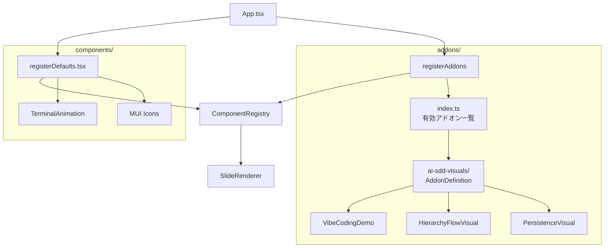

# ビジュアルコンポーネントのアドオン化

**ドキュメント種別:** 技術設計書 (Design Doc)
**SDDフェーズ:** Plan (計画/設計)
**最終更新日:** 2026-01-30
**関連 Spec:** [visual-addon_spec.md](./visual-addon_spec.md)
**関連 PRD:** [visual-addon.md](../requirement/visual-addon.md)

---

# 1. 実装ステータス

**ステータス:** 🟢 実装完了

## 1.1. 実装進捗

| モジュール/機能                        | ステータス | 備考 |
|--------------------------------------|----------|------|
| `src/addons/types.ts`                | 🟢       |      |
| `src/addons/ai-sdd-visuals/index.ts` | 🟢       |      |
| `src/addons/index.ts`                | 🟢       |      |
| `src/addons/register.ts`             | 🟢       |      |
| ビジュアルファイル移動                    | 🟢       |      |
| `registerDefaults.tsx` 修正           | 🟢       |      |
| `App.tsx` 修正                        | 🟢       |      |
| `src/visuals/` 削除                   | 🟢       |      |

---

# 2. 設計目標

1. **本体との分離**: ビジュアルコンポーネントをアドオンとして本体コードから独立させる
2. **既存動作の維持**: ComponentRegistry の仕組みを変更せず、表示・動作に影響を与えない（DC-001, DC-002）
3. **シンプルな管理**: アドオンの有効/無効を import の追加/削除のみで切り替え可能にする（FR-003）
4. **型安全性**: AddonDefinition 型による構造統一で型安全なアドオン定義を実現する（T-001）

---

# 3. 技術スタック

| 領域           | 採用技術                    | 選定理由                                         |
|---------------|--------------------------|------------------------------------------------|
| 型定義          | TypeScript               | プロジェクト既存のスタック（T-001）                         |
| コンポーネント登録 | ComponentRegistry        | 既存の仕組みを活用し、変更を最小化（DC-001）                   |
| スタイル         | CSS Modules              | 各ビジュアルが既に CSS Modules を使用しており、そのまま移動可能      |

---

# 4. アーキテクチャ

## 4.1. システム構成図



## 4.2. モジュール分割

| モジュール名                       | 責務                                           | 依存関係                          | 配置場所                             |
|----------------------------------|----------------------------------------------|-------------------------------|-------------------------------------|
| `types.ts`                       | AddonDefinition, AddonComponent 型定義           | ComponentRegistry（型のみ）         | `src/addons/types.ts`               |
| `ai-sdd-visuals/index.ts`        | AI-SDD デモ用ビジュアルアドオンの定義                      | types.ts, 各ビジュアルコンポーネント       | `src/addons/ai-sdd-visuals/index.ts`|
| `index.ts`                       | 有効アドオン一覧の管理                                 | types.ts, 各アドオン定義              | `src/addons/index.ts`               |
| `register.ts`                    | 全アドオンの ComponentRegistry への一括登録              | ComponentRegistry, index.ts    | `src/addons/register.ts`            |

## 4.3. ディレクトリ構成

```
src/
├── addons/                              # 新規
│   ├── types.ts                         # AddonDefinition 型
│   ├── index.ts                         # 有効アドオン一覧
│   ├── register.ts                      # 全アドオンの一括登録
│   └── ai-sdd-visuals/                  # AI-SDD デモ用ビジュアルセット
│       ├── index.ts                     # アドオン定義
│       ├── VibeCodingDemo.tsx           # src/visuals/ から移動
│       ├── VibeCodingDemo.module.css
│       ├── HierarchyFlowVisual.tsx
│       ├── HierarchyFlowVisual.module.css
│       ├── PersistenceVisual.tsx
│       └── PersistenceVisual.module.css
├── components/
│   ├── ComponentRegistry.tsx            # 変更なし
│   └── registerDefaults.tsx             # ビジュアル3つの登録を削除
```

---

# 5. データモデル

```typescript
import type { RegisteredComponent } from '../components/ComponentRegistry'

/** アドオンが提供するコンポーネント定義 */
type AddonComponent = {
  name: string
  component: RegisteredComponent
}

/** アドオン定義 */
type AddonDefinition = {
  name: string
  components: AddonComponent[]
}
```

---

# 6. インターフェース定義

```typescript
// src/addons/register.ts
import { registerComponent } from '../components/ComponentRegistry'
import { addons } from './index'

/** 全アドオンのコンポーネントを ComponentRegistry に登録する */
export function registerAddons(): void {
  for (const addon of addons) {
    for (const { name, component } of addon.components) {
      registerComponent(name, component)
    }
  }
}
```

---

# 7. 非機能要件実現方針

| 要件                     | 実現方針                                          |
|------------------------|------------------------------------------------|
| 型安全性（T-001）           | AddonDefinition 型で構造を強制し、any 型を使用しない           |
| 表示互換性（DC-002）        | CSS Modules をそのまま移動し、スタイルの変更なし                |
| ビルド互換性                | Vite の既存設定で CSS Modules が動作することを確認             |
| ビルドサイズ（NFR-001）      | ファイル移動とエントリポイント追加のみで新規ロジックを最小化。Vite の tree-shaking により未使用コードは除外される |
| 開発者体験（NFR-002）        | `src/addons/index.ts` の配列に import を追加/削除するだけでアドオンの有効/無効を切り替え可能。他ファイルの修正不要 |

---

# 8. テスト戦略

| テストレベル | 対象                           | カバレッジ目標 |
|-----------|------------------------------|----------|
| 型チェック    | `npx tsc --noEmit`           | エラー 0件   |
| ユニットテスト | `npx vitest run`（既存34件）       | 全件パス    |
| ビルド      | `npm run build`              | エラー 0件   |
| 表示確認    | ブラウザでの目視確認                   | 既存と同一    |

---

# 9. 設計判断

## 9.1. 決定事項

| 決定事項                   | 選択肢                                                    | 決定内容                        | 理由                                                         |
|------------------------|--------------------------------------------------------|----------------------------|------------------------------------------------------------|
| アドオン登録先               | (A) default 側 (B) custom 側                              | (B) custom 側               | アドオンはデフォルトを上書き可能であるべき。将来的にユーザーがデフォルトの VibeCodingDemo を別の実装に差し替える際に custom 側が適切 |
| 有効/無効管理方式             | (A) 設定ファイル (B) import 追加/削除 (C) 環境変数                    | (B) import 追加/削除            | 設定ファイルのパースやバリデーション不要でシンプル。TypeScript の型チェックが効く          |
| スタイル管理方針（A-002 対応）   | (A) style.css に集約 (B) アドオン内 CSS Modules を維持              | (B) アドオン内 CSS Modules を維持   | 既存ビジュアルが CSS Modules を使用しており、集約すると移動コストが増大。アドオンの独立性を優先  |
| registerAddons の呼び出し場所 | (A) App.tsx の関数内 (B) App.tsx のモジュールスコープ (C) main.tsx     | (B) App.tsx のモジュールスコープ      | registerDefaultComponents と同じパターンを踏襲。モジュール読み込み時に一度だけ実行   |

---

# 10. 変更履歴

## v1.1.0 (2026-01-30)

**変更内容:**

- 非機能要件実現方針に NFR-001（ビルドサイズ）、NFR-002（開発者体験）を追加

## v1.0.0 (2026-01-30)

**変更内容:**

- 初版作成
- ビジュアルコンポーネントのアドオン化設計を定義
