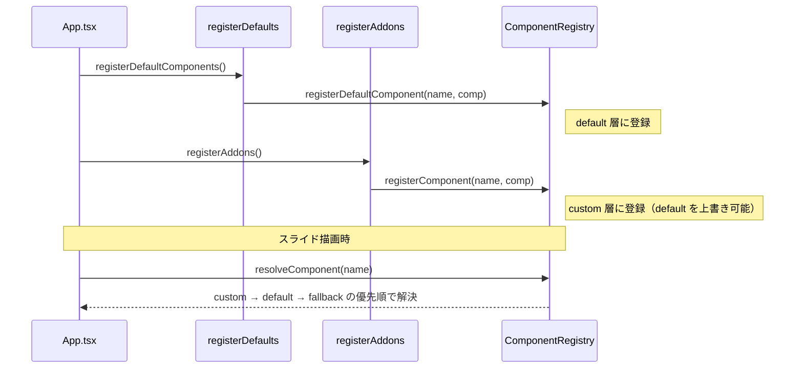

# ビジュアルコンポーネントのアドオン化

**ドキュメント種別:** 抽象仕様書 (Spec)
**SDDフェーズ:** Specify (仕様化)
**最終更新日:** 2026-01-30
**関連 Design Doc:** [visual-addon_design.md](./visual-addon_design.md)
**関連 PRD:** [visual-addon.md](../requirement/visual-addon.md)

---

# 1. 背景

プレゼンテーションアプリケーションでは、ビジュアルコンポーネント（VibeCodingDemo, HierarchyFlowVisual, PersistenceVisual）が `src/visuals/` に配置され、`registerDefaults.tsx` でデフォルトコンポーネントとして登録されている。これらのビジュアルは AI-SDD デモ用の特化コンポーネントであり、プレゼンテーション本体の汎用コンポーネントとは性質が異なる。

本体コードとビジュアルの結合を解消し、アドオンとして独立管理可能にすることで、拡張性と保守性を向上させる。

# 2. 概要

ビジュアルコンポーネントを「アドオン」という単位でグループ化し、統一された型定義（AddonDefinition）で構造を規定する。アドオンは既存の ComponentRegistry の custom 側登録 API を利用して登録され、本体コードの変更なしに追加・削除が可能となる。

アドオンの有効/無効は、エントリポイントファイル（`src/addons/index.ts`）での import 操作のみで切り替える。

# 3. 要求定義

## 3.1. 機能要件 (Functional Requirements)

| ID     | 要件                                      | 優先度 | 根拠                                    | PRD参照  |
|--------|------------------------------------------|------|---------------------------------------|--------|
| FR-001 | アドオンは AddonDefinition 型で構造を統一する            | 必須   | アドオン間の一貫性を確保するため                      | FR-001 |
| FR-002 | アドオンのコンポーネントは registerComponent で登録する       | 必須   | 既存の ComponentRegistry の仕組みを活用するため      | FR-002 |
| FR-003 | アドオンの有効/無効は import の追加/削除で管理する             | 必須   | 設定ファイル不要でシンプルな管理を実現するため                | FR-003 |
| FR-004 | 既存3ビジュアルを addons/ 配下に移動しアドオンとして再構成する       | 必須   | 本体コードからの分離を実現するため                     | FR-004 |

## 3.2. 設計制約

| ID     | 制約                                      | 根拠                      | PRD参照  |
|--------|------------------------------------------|--------------------------|--------|
| DC-001 | ComponentRegistry の仕組みを変更しない             | 既存機能の互換性維持               | DC-001 |
| DC-002 | プレゼンテーションの表示・動作に変更がないこと                  | ビジネス価値の維持                | DC-002 |

# 4. API

| ディレクトリ            | ファイル名       | エクスポート              | 概要                                      |
|---------------------|---------------|------------------------|------------------------------------------|
| `src/addons`        | `types.ts`    | `AddonDefinition`      | アドオン定義型                                  |
| `src/addons`        | `types.ts`    | `AddonComponent`       | アドオンコンポーネント定義型                          |
| `src/addons`        | `index.ts`    | `addons`               | 有効なアドオン定義の配列                            |
| `src/addons`        | `register.ts` | `registerAddons()`     | 全アドオンを ComponentRegistry に一括登録する関数       |
| `src/addons/ai-sdd-visuals` | `index.ts` | `aiSddVisualsAddon` | AI-SDD デモ用ビジュアルアドオン定義                    |

## 4.1. 型定義

```typescript
/** アドオンが提供するコンポーネント定義 */
type AddonComponent = {
  name: string
  component: RegisteredComponent
}

/** アドオン定義 */
type AddonDefinition = {
  name: string
  components: AddonComponent[]
}
```

# 5. 用語集

| 用語 | 説明 |
|------|------|
| アドオン（Addon） | プレゼンテーション本体から独立したコンポーネントのパッケージ単位 |
| AddonDefinition | アドオンの構造を定義する TypeScript 型。名前とコンポーネント一覧を持つ |
| AddonComponent | アドオン内の個別コンポーネント定義。登録名と React コンポーネントのペア |
| ComponentRegistry | コンポーネント名から実コンポーネントを解決するレジストリ機構 |

# 6. 使用例

```tsx
// アドオン定義の例（src/addons/ai-sdd-visuals/index.ts）
import type { AddonDefinition } from '../types'
import { VibeCodingDemo } from './VibeCodingDemo'

export const aiSddVisualsAddon: AddonDefinition = {
  name: 'ai-sdd-visuals',
  components: [
    { name: 'VibeCodingDemo', component: VibeCodingDemo },
  ],
}
```

```tsx
// アドオンの有効化（src/addons/index.ts）
import type { AddonDefinition } from './types'
import { aiSddVisualsAddon } from './ai-sdd-visuals'

export const addons: AddonDefinition[] = [
  aiSddVisualsAddon,
]
```

```tsx
// アドオンの一括登録（src/addons/register.ts）
import { registerComponent } from '../components/ComponentRegistry'
import { addons } from './index'

export function registerAddons(): void {
  for (const addon of addons) {
    for (const { name, component } of addon.components) {
      registerComponent(name, component)
    }
  }
}
```

# 7. 振る舞い図



# 8. 制約事項

- 既存の ComponentRegistry の API（registerDefaultComponent, registerComponent, resolveComponent）を変更しない（A-001）
- TypeScript strict mode に準拠する（T-001）
- Reveal.js の DOM 構造との互換性を維持する（T-002）
- プレゼンテーションの表示品質に影響を与えない（B-001）

---

## PRD参照

- 対応PRD: [visual-addon.md](../requirement/visual-addon.md)
- カバーする要求: UR-001, FR-001, FR-002, FR-003, FR-004, DC-001, DC-002
