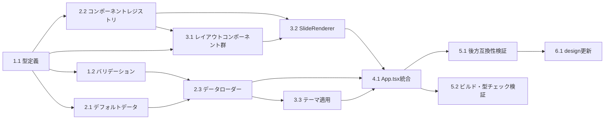

# タスク分解: スライドコンテンツカスタマイズ (DEM-001)

**設計書:** [slide-content-customization_design.md](../../specification/slide-content-customization_design.md)
**仕様書:** [slide-content-customization_spec.md](../../specification/slide-content-customization_spec.md)
**PRD:** [slide-content-customization.md](../../requirement/slide-content-customization.md)
**作成日:** 2026-01-30

---

## 依存関係図

---

## 1. 基盤タスク

### 1.1. 型定義の作成

- [x] `src/data/types.ts` を作成
- [x] `PresentationData`, `PresentationMeta`, `SlideData`, `SlideContent`, `ContentItem`, `ComponentReference`, `SlideMeta`, `ThemeData`, `ColorPalette`, `FontDefinition` 型を定義
- [x] `ValidationError` 型を定義
- [x] `src/data/index.ts` でre-export

**完了条件:**
- specの4.2節の型定義がすべて実装されている
- `npm run build` で型エラーがない

**依存:** なし
**対応要件:** FR-001, NFR-005

---

### 1.2. バリデーション関数の作成

- [x] `src/data/loader.ts` 内に `validatePresentationData` 型ガード関数を実装
- [x] `getValidationErrors` 関数を実装（エラー箇所のJSONパス、エラーメッセージ、期待値、実際値を返す）
- [x] 必須フィールド（meta.title, slides配列, 各slideのid/layout/content）の検証
- [x] テストを作成: 有効なデータでtrue、不正なデータでfalse、エラー詳細の検証

**完了条件:**
- 型ガードが正しく動作する（有効/無効データの判別）
- エラーメッセージにパス情報が含まれる
- ユニットテストがパスする

**依存:** 1.1
**対応要件:** FR-013, FR-014

---

## 2. コアタスク

### 2.1. デフォルトスライドデータの作成

- [x] 既存の10枚のスライドコンポーネント（TitleSlide〜SummarySlide）の内容を分析
- [x] `src/data/default-slides.json` を作成し、既存スライドの内容を忠実にJSON化
- [x] 各スライドに適切なレイアウト種別（title, content, two-column, workflow, features, demo, summary）を割り当て
- [x] テキストコンテンツ、リスト項目、強調テキスト等を構造化データとして定義
- [x] メタ情報（transition、スピーカーノート等）を定義

**完了条件:**
- 10枚すべてのスライドがJSON形式で表現されている
- 既存コンポーネントのテキスト内容と一致している
- `PresentationData` 型に適合する

**依存:** 1.1
**対応要件:** FR-001, FR-002, FR-003, FR-004, FR-011

---

### 2.2. コンポーネントレジストリの実装

- [x] `src/components/ComponentRegistry.tsx` を作成
- [x] `registerComponent(name, component)` 関数を実装
- [x] `resolveComponent(name)` 関数を実装（カスタム → デフォルト → フォールバックの優先順）
- [x] `getRegisteredComponents()` 関数を実装
- [x] フォールバックコンポーネント（未登録時の表示）を実装
- [x] テストを作成: 登録、解決、上書き、未登録時フォールバックの検証

**完了条件:**
- コンポーネントの登録・解決が正しく動作する
- 上書き登録が既存コンポーネントを置き換える
- 未登録名でフォールバックコンポーネントが返される
- ユニットテストがパスする

**依存:** 1.1
**対応要件:** FR-008, FR-009, FR-010

---

### 2.3. データローダーの実装

- [x] `src/data/loader.ts` に `loadPresentationData` 関数を実装
- [x] PresentationDataオブジェクトが渡された場合: バリデーション後に返す
- [x] データ未指定時: デフォルトデータを返す
- [x] バリデーション失敗時: コンソールにエラー出力し、デフォルトデータにフォールバック
- [x] テストを作成: 正常データ、未指定時フォールバック、不正データ時フォールバックの検証

**完了条件:**
- 正常データが正しく読み込まれる
- 未指定時にデフォルトデータが返される
- 不正データ時にフォールバックが動作しエラーが出力される
- ユニットテストがパスする

**依存:** 1.1, 1.2, 2.1
**対応要件:** FR-005, FR-012

---

## 3. 統合タスク

### 3.1. レイアウトコンポーネント群の実装

- [x] `src/layouts/` ディレクトリを作成
- [x] `TitleLayout.tsx` — タイトルスライド用レイアウト
- [x] `ContentLayout.tsx` — 見出し+本文+リスト用レイアウト
- [x] `TwoColumnLayout.tsx` — 左右2カラムレイアウト（SlideRenderer内で既存TwoColumnGridを使用）
- [x] `WorkflowLayout.tsx` — ワークフロー図用レイアウト（SlideRenderer内で実装）
- [x] `FeaturesLayout.tsx` — 機能一覧タイル用レイアウト（SlideRenderer内で実装）
- [x] `DemoLayout.tsx` — デモ画面用レイアウト（SlideRenderer内でBleedLayoutを使用）
- [x] `SummaryLayout.tsx` — まとめスライド用レイアウト（SlideRenderer内でSectionLayoutを使用）
- [x] `CustomLayout.tsx` — カスタムコンポーネント参照用レイアウト（SlideRenderer内で実装）
- [x] `src/layouts/index.ts` でレイアウト登録とre-export
- [x] 各レイアウトは `<section>` 要素を返し、Reveal.jsのDOM構造を維持
- [x] 各レイアウトは `SlideContent` をpropsとして受け取る

**完了条件:**
- 全8種のレイアウトコンポーネントが実装されている
- 各レイアウトが `<section>` 要素をルートに持つ
- 既存スライドの見た目を再現できるスタイルが適用されている
- コンポーネントレジストリにデフォルトレイアウトとして登録されている

**依存:** 1.1, 2.2
**対応要件:** FR-002, FR-007, NFR-004

---

### 3.2. SlideRendererの実装

- [x] `src/components/SlideRenderer.tsx` を作成
- [x] `SlideRendererProps`（slides）を受け取る
- [x] 各スライドデータに対してレジストリからコンポーネントを解決しレンダリング
- [x] `SlideContent.component` が指定されている場合、カスタムコンポーネントにpropsを渡す
- [ ] `SlideMeta` からReveal.jsのdata属性（data-transition等）を設定
- [ ] テストを作成: デフォルトデータで10枚のスライドが正しくレンダリングされること

**完了条件:**
- スライドデータからReactコンポーネントへの変換が正しく動作する
- `<section>` 要素にReveal.js属性が設定される
- カスタムコンポーネントへのprops受け渡しが動作する
- 統合テストがパスする

**依存:** 2.2, 3.1
**対応要件:** FR-005, FR-010, NFR-004

---

### 3.3. テーマ適用機能の実装

- [x] `ThemeData` からCSS変数を生成してDOMに適用するロジックを実装
- [x] カラーパレット（primary, accent, background, text）をCSS変数に変換
- [x] フォント定義（heading, body, code）をCSS変数に変換
- [x] `customCSS` をstyleタグとして挿入
- [ ] `src/styles/style.css` に必要なCSS変数のフォールバック値を追加

**完了条件:**
- テーマデータからCSS変数が正しく生成・適用される
- テーマ未指定時にデフォルトスタイルが維持される
- カスタムCSSが正しく挿入される

**依存:** 1.1, 2.3
**対応要件:** FR-006, NFR-003

---

## 4. 統合・仕上げタスク

### 4.1. App.tsx のデータ駆動型への改修

- [x] `App` コンポーネントに `presentationData?: PresentationData` propsを追加
- [x] `loadPresentationData` を使用してデータを読み込み
- [x] 既存のハードコードされたスライドコンポーネントを `SlideRenderer` に置き換え
- [x] テーマデータがある場合はテーマ適用ロジックを実行
- [x] `useReveal` フックとの互換性を維持
- [ ] デフォルトデータ使用時に既存と同一のDOM構造が生成されることを確認

**完了条件:**
- `<App />` でデフォルトプレゼンテーションが表示される
- `<App presentationData={...} />` でカスタムデータが表示される
- Reveal.jsの初期化・操作が正しく動作する
- `npm run build` が成功する

**依存:** 2.3, 3.2, 3.3
**対応要件:** FR-005, FR-012, NFR-003, NFR-004

---

## 5. テスト・検証タスク

### 5.1. 後方互換性の検証

- [ ] デフォルトデータでのプレゼンテーション表示を確認（要目視確認）
- [ ] 既存の10枚すべてのスライドの見た目が変更前と一致することを目視確認（要目視確認）
- [ ] Reveal.jsのナビゲーション（矢印キー、スペースキー）が正常に動作することを確認（要目視確認）
- [ ] フラグメント表示が正しく動作することを確認（要目視確認）
- [ ] トランジションアニメーションが正しく動作することを確認（要目視確認）
- [x] `npm run build` でプロダクションビルドが成功することを確認

**完了条件:**
- デフォルトデータ使用時に既存プレゼンテーションと視覚的差異がゼロ
- Reveal.jsの全機能が正常動作
- プロダクションビルドが成功

**依存:** 4.1
**対応要件:** NFR-003, NFR-004, B-001, B-002

---

### 5.2. ビルド・型チェックの検証

- [x] `npm run build` でTypeScript strict modeでのビルドが成功することを確認
- [x] 未使用変数・未使用パラメータの警告がないことを確認
- [ ] ViteのHMRでJSONデータ変更が即座に反映されることを確認（要目視確認）

**完了条件:**
- TypeScript strictモードでビルドエラーゼロ
- HMRによるJSONデータ変更の即時反映を確認

**依存:** 4.1
**対応要件:** NFR-001, NFR-005, T-001

---

## 6. ドキュメント更新タスク

### 6.1. 設計書の実装ステータス更新

- [x] `slide-content-customization_design.md` の実装ステータスを更新（🔴→🟢）
- [x] 実装中に発生した設計判断があれば「9. 設計判断」セクションに追記
- [x] 未解決の課題の対応状況を更新

**完了条件:**
- 実装ステータスが実態と一致している
- 重要な設計判断が記録されている

**依存:** 5.1, 5.2
**対応要件:** D-001

---

## 要求カバレッジ

| 要求ID | 要求内容 | 対応タスク |
|:-------|:---------|:---------|
| FR-001 | JSONデータによるスライド定義・反映 | 1.1, 2.1 |
| FR-002 | スライド構成（枚数・順序・レイアウト種別）のJSON定義 | 2.1, 3.1 |
| FR-003 | テキストコンテンツのJSON定義 | 2.1 |
| FR-004 | メタ情報のJSON定義 | 2.1 |
| FR-005 | JSONデータの読み込みと動的レンダリング | 2.3, 3.2, 4.1 |
| FR-006 | テーマの外部定義と切り替え | 3.3 |
| FR-007 | レイアウト種別の指定と追加登録 | 3.1 |
| FR-008 | カスタムコンポーネントの名前付き登録 | 2.2 |
| FR-009 | デフォルトコンポーネントの上書き | 2.2 |
| FR-010 | コンポーネントへのprops受け渡し | 2.2, 3.2 |
| FR-011 | デフォルトデータの提供 | 2.1 |
| FR-012 | フォールバック表示 | 2.3, 4.1 |
| FR-013 | JSONスキーマに基づくバリデーション | 1.2 |
| FR-014 | エラーメッセージの表示 | 1.2 |
| NFR-001 | HMR即時反映 | 5.2 |
| NFR-003 | 後方互換性（視覚的差異ゼロ） | 5.1 |
| NFR-004 | Reveal.js DOM構造の維持 | 3.1, 3.2, 4.1 |
| NFR-005 | TypeScript型安全性 | 1.1, 5.2 |
