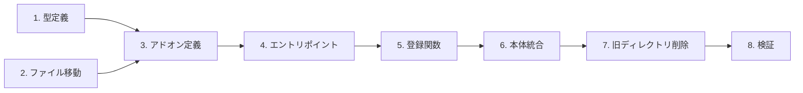

# DEM-002: ビジュアルコンポーネントのアドオン化

**関連設計書**: [visual-addon_design.md](../../specification/visual-addon_design.md)
**関連仕様書**: [visual-addon_spec.md](../../specification/visual-addon_spec.md)
**関連PRD**: [visual-addon.md](../../requirement/visual-addon.md)

---

## タスク依存関係

---

## 1. 基盤タスク

### 1.1. AddonDefinition 型定義の作成

**カテゴリ**: 基盤
**対応モジュール**: `src/addons/types.ts`
**依存**: なし

- [ ] `src/addons/` ディレクトリを作成
- [ ] `src/addons/types.ts` を作成
  - `AddonComponent` 型（name: string, component: RegisteredComponent）
  - `AddonDefinition` 型（name: string, components: AddonComponent[]）
  - `RegisteredComponent` は `ComponentRegistry.tsx` から型のみ import

**完了条件**: `npx tsc --noEmit` でエラーなし

---

### 1.2. ビジュアルファイルの移動

**カテゴリ**: 基盤
**対応モジュール**: `src/addons/ai-sdd-visuals/`
**依存**: なし

- [ ] `src/addons/ai-sdd-visuals/` ディレクトリを作成
- [ ] 以下のファイルを `src/visuals/` → `src/addons/ai-sdd-visuals/` に移動
  - `VibeCodingDemo.tsx` + `VibeCodingDemo.module.css`
  - `HierarchyFlowVisual.tsx` + `HierarchyFlowVisual.module.css`
  - `PersistenceVisual.tsx` + `PersistenceVisual.module.css`
- [ ] 各ファイル内のインポートパスが正しいことを確認（CSS Modules は相対パスのため変更不要）

**完了条件**: ファイルが新しい場所に存在し、旧ファイルは `git mv` で移動済み

---

## 2. コアタスク

### 2.1. AI-SDD ビジュアルアドオン定義の作成

**カテゴリ**: コア
**対応モジュール**: `src/addons/ai-sdd-visuals/index.ts`
**依存**: 1.1, 1.2

- [ ] `src/addons/ai-sdd-visuals/index.ts` を作成
  - `AddonDefinition` 型を `../types` から import
  - 3つのビジュアルコンポーネントを同ディレクトリから import
  - `aiSddVisualsAddon` を `AddonDefinition` として export

**完了条件**: `npx tsc --noEmit` でエラーなし

---

### 2.2. 有効アドオン一覧の作成

**カテゴリ**: コア
**対応モジュール**: `src/addons/index.ts`
**依存**: 2.1

- [ ] `src/addons/index.ts` を作成
  - `AddonDefinition` 型を `./types` から import
  - `aiSddVisualsAddon` を `./ai-sdd-visuals` から import
  - `addons: AddonDefinition[]` 配列としてエクスポート

**完了条件**: `npx tsc --noEmit` でエラーなし

---

### 2.3. registerAddons 関数の作成

**カテゴリ**: コア
**対応モジュール**: `src/addons/register.ts`
**依存**: 2.2

- [ ] `src/addons/register.ts` を作成
  - `registerComponent` を `../components/ComponentRegistry` から import
  - `addons` を `./index` から import
  - `registerAddons()` 関数を export（全アドオンの全コンポーネントを registerComponent で登録）

**完了条件**: `npx tsc --noEmit` でエラーなし

---

## 3. 統合タスク

### 3.1. 本体コードとの統合

**カテゴリ**: 統合
**対応モジュール**: `src/components/registerDefaults.tsx`, `src/App.tsx`
**依存**: 2.3

- [ ] `src/components/registerDefaults.tsx` を修正
  - VibeCodingDemo, HierarchyFlowVisual, PersistenceVisual の import を削除
  - `registerDefaultComponents()` から3つのビジュアルの `registerDefaultComponent` 呼び出しを削除
- [ ] `src/App.tsx` を修正
  - `registerAddons` を `./addons/register` から import
  - `registerDefaultComponents()` の直後に `registerAddons()` を呼び出し（モジュールスコープ）

**完了条件**: `npx tsc --noEmit` でエラーなし

---

### 3.2. 旧ディレクトリの削除

**カテゴリ**: 統合
**対応モジュール**: `src/visuals/`
**依存**: 3.1

- [ ] `src/visuals/` ディレクトリが空であることを確認
- [ ] `src/visuals/` ディレクトリを削除

**完了条件**: `src/visuals/` が存在しない

---

## 4. テストタスク

### 4.1. 全体検証

**カテゴリ**: テスト
**依存**: 3.2

- [ ] `npx tsc --noEmit` — 型チェックでエラー 0 件
- [ ] `npx vitest run` — 既存テスト全34件パス
- [ ] `npm run build` — ビルドエラー 0 件

**完了条件**: 上記3つのコマンドがすべて成功

---

## 5. 仕上げタスク

### 5.1. 設計書の実装ステータス更新

**カテゴリ**: 仕上げ
**依存**: 4.1

- [ ] `visual-addon_design.md` の実装ステータスを 🔴 → 🟢 に更新
- [ ] 各モジュールのステータスを更新

**完了条件**: 設計書のステータスが実装状態を反映している

---

## 要求カバレッジ

| 要求ID   | 要求内容                                    | 対応タスク     |
|:--------|:----------------------------------------|:----------|
| UR-001  | ビジュアルコンポーネントをアドオンとして本体から分離              | 全タスク      |
| FR-001  | AddonDefinition 型で構造を統一する                 | 1.1, 2.1  |
| FR-002  | ComponentRegistry の registerComponent で登録する | 2.3, 3.1  |
| FR-003  | import の追加/削除で有効/無効を管理する                  | 2.2       |
| FR-004  | 既存3ビジュアルを addons/ 配下に移動しアドオンとして再構成する      | 1.2, 2.1  |
| NFR-001 | アドオン化によるビルドサイズの増加を最小限に抑える               | 4.1       |
| NFR-002 | アドオンの追加・削除は index.ts の import 変更のみで完結する   | 2.2, 3.1  |
| DC-001  | ComponentRegistry の仕組みを変更しない              | 2.3, 3.1  |
| DC-002  | プレゼンテーションの表示・動作に変更がないこと                  | 4.1       |
