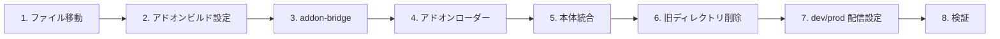

# DEM-002: ビジュアルコンポーネントのアドオン化

**関連設計書**: [visual-addon_design.md](../../specification/visual-addon_design.md)
**関連仕様書**: [visual-addon_spec.md](../../specification/visual-addon_spec.md)
**関連PRD**: [visual-addon.md](../../requirement/visual-addon.md)

---

## タスク依存関係

---

## 1. 基盤タスク

### 1.1. ビジュアルファイルの移動

**カテゴリ**: 基盤
**対応モジュール**: `addons/ai-sdd-visuals/`
**依存**: なし

- [x] `addons/ai-sdd-visuals/` ディレクトリを作成
- [x] 以下のファイルを `src/visuals/` → `addons/ai-sdd-visuals/` に移動
  - `VibeCodingDemo.tsx` + `VibeCodingDemo.module.css`
  - `HierarchyFlowVisual.tsx` + `HierarchyFlowVisual.module.css`
  - `PersistenceVisual.tsx` + `PersistenceVisual.module.css`
- [x] `icons.tsx` を `addons/ai-sdd-visuals/` に配置

**完了条件**: ファイルが新しい場所に存在し、旧ファイルは移動済み

---

### 1.2. アドオンエントリポイントの作成

**カテゴリ**: 基盤
**対応モジュール**: `addons/entry.ts`
**依存**: 1.1

- [x] `addons/entry.ts` を作成
  - `window.__ADDON_REGISTER__` を取得
  - 3つのビジュアルコンポーネントを登録
  - `Window` グローバル型を `declare global` で定義

**完了条件**: entry.ts が3コンポーネントを登録する

---

## 2. ビルド設定タスク

### 2.1. アドオンビルド設定の作成

**カテゴリ**: ビルド
**対応モジュール**: `addons/vite.config.ts`
**依存**: 1.2

- [x] `addons/vite.config.ts` を作成
  - IIFE ライブラリモードでビルド
  - React, react/jsx-runtime を external 指定
  - CSS インライン化プラグイン（`cssInlinePlugin`）
  - manifest.json 生成プラグイン（`manifestPlugin`）
  - `outDir` を `resolve(__dirname, 'dist')` に設定
- [x] `package.json` の `build:addons` スクリプトを更新
  - `vite build --config addons/vite.config.ts`

**完了条件**: `npm run build:addons` で `addons/dist/` に IIFE バンドルと manifest.json が生成される

---

## 3. ホストアプリ側タスク

### 3.1. addon-bridge の作成

**カテゴリ**: コア
**対応モジュール**: `src/addon-bridge.ts`
**依存**: なし

- [x] `src/addon-bridge.ts` を作成
  - `window.React` と `window.ReactJSXRuntime` を公開
  - `window.__ADDON_REGISTER__` コールバックを定義
  - コールバック内で `registerComponent()` を呼び出し
  - `Window` グローバル型を `declare global` で定義

**完了条件**: `npx tsc --noEmit` でエラーなし

---

### 3.2. アドオンローダーの実装

**カテゴリ**: コア
**対応モジュール**: `src/main.tsx`
**依存**: 3.1

- [x] `src/main.tsx` にアドオンローダーを実装
  - `addon-bridge.ts` を import（副作用 import）
  - `loadAddons()` 関数: `/addons/manifest.json` を fetch
  - `loadAddonScript()` 関数: `<script>` タグを動的生成してバンドルをロード
  - すべてのアドオンロード完了後に React アプリを描画

**完了条件**: アプリ起動時に manifest.json を取得し、アドオンを動的ロードする

---

## 4. 統合タスク

### 4.1. 本体コードとの統合

**カテゴリ**: 統合
**対応モジュール**: `src/components/registerDefaults.tsx`, `src/App.tsx`
**依存**: 3.2

- [x] `src/components/registerDefaults.tsx` を修正
  - VibeCodingDemo, HierarchyFlowVisual, PersistenceVisual の import を削除
  - `registerDefaultComponents()` から3つのビジュアルの `registerDefaultComponent` 呼び出しを削除
- [x] `src/App.tsx` から旧アドオン登録コード（`registerAddons` 等）を削除

**完了条件**: `npx tsc --noEmit` でエラーなし

---

### 4.2. 旧ディレクトリの削除

**カテゴリ**: 統合
**対応モジュール**: `src/visuals/`, `src/addons/`
**依存**: 4.1

- [x] `src/visuals/` ディレクトリを削除
- [x] `src/addons/` ディレクトリを削除（types.ts, index.ts, register.ts, ai-sdd-visuals/index.ts 含む）

**完了条件**: `src/visuals/` と `src/addons/` が存在しない

---

### 4.3. dev/prod 配信設定

**カテゴリ**: 統合
**対応モジュール**: `vite.config.ts`, `tsconfig.json`, `.gitignore`
**依存**: 4.2

- [x] `vite.config.ts` に dev server 設定を追加
  - `server.fs.allow` で `addons/` ディレクトリを許可
  - `resolve.alias` で `/addons` を `addons/dist/` にマッピング
  - `copyAddonsPlugin` で prod ビルド時に `dist/addons/` へコピー
- [x] `tsconfig.json` の `include` に `"addons"` を追加、`exclude` で `addons/*/vite.config.ts` と `addons/*/dist` を除外
- [x] `.gitignore` に `addons/*/dist/` を追加
- [x] 旧 `vite.config.addon.ts` を削除
- [x] `public/addons/` を削除

**完了条件**: dev server と prod ビルドの両方でアドオンが正しく配信される

---

## 5. テストタスク

### 5.1. 全体検証

**カテゴリ**: テスト
**依存**: 4.3

- [x] `npm run build:addons` — `addons/dist/` に出力
- [x] `npx tsc --noEmit` — 型チェックでエラー 0 件
- [x] `npx vitest run` — 既存テスト全34件パス
- [x] `npm run build` — ビルドエラー 0 件、`dist/addons/` にコピー

**完了条件**: 上記4つのコマンドがすべて成功

---

## 6. 仕上げタスク

### 6.1. 設計書の実装ステータス更新

**カテゴリ**: 仕上げ
**依存**: 5.1

- [x] `visual-addon_design.md` を v2.0.0 に全面改訂
- [x] `visual-addon_spec.md` を動的ロード方式に全面改訂
- [x] `visual-addon.md`（PRD）の機能要求を現状に合わせて更新
- [x] 本タスク定義を実際の実装内容に合わせて更新

**完了条件**: SDD ドキュメントが実装状態を正確に反映している

---

## 要求カバレッジ

| 要求ID   | 要求内容                                      | 対応タスク        |
|:--------|:------------------------------------------|:-------------|
| UR-001  | ビジュアルコンポーネントをアドオンとして本体から分離                | 全タスク         |
| FR-001  | アドオンを独立した IIFE バンドルとしてビルドする                 | 1.2, 2.1     |
| FR-002  | ComponentRegistry の registerComponent で登録する | 3.1, 4.1     |
| FR-003  | manifest.json のエントリ追加/削除で有効/無効を管理する          | 2.1, 3.2     |
| FR-004  | 既存3ビジュアルを addons/ 配下に移動し独立バンドルとして再構成する      | 1.1, 1.2     |
| NFR-001 | アドオン化によるビルドサイズの増加を最小限に抑える                 | 2.1, 5.1     |
| NFR-002 | アドオンの追加・削除は manifest.json の変更のみで完結する         | 2.1, 3.2     |
| DC-001  | ComponentRegistry の仕組みを変更しない                | 3.1, 4.1     |
| DC-002  | プレゼンテーションの表示・動作に変更がないこと                    | 5.1          |
