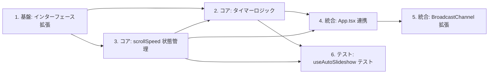

# DEM-008: タイマーベース自動スクロール（Auto Scroll Timer）

**機能名:** auto-scroll-timer
**関連 Design Doc:** [auto-scroll-timer_design.md](../../specification/auto-scroll-timer_design.md)
**関連 Spec:** [auto-scroll-timer_spec.md](../../specification/auto-scroll-timer_spec.md)
**関連 PRD:** [auto-scroll-timer.md](../../requirement/auto-scroll-timer.md)

---

## 依存関係図

---

## タスク一覧

### 1. 基盤: useAutoSlideshow インターフェース拡張

**カテゴリ:** 基盤
**対象ファイル:** `src/hooks/useAutoSlideshow.ts`

**作業内容:**

- [ ] `UseAutoSlideshowOptions` に `initialScrollSpeed?: number` を追加
- [ ] `UseAutoSlideshowReturn` に `scrollSpeed: number` と `setScrollSpeed: (speed: number) => void` を追加
- [ ] `DEFAULT_SCROLL_SPEED = 20` 定数を定義
- [ ] 関数シグネチャを更新（引数の分割代入に `initialScrollSpeed` を追加）

**完了条件:**

- `useAutoSlideshow` の型定義が design doc のインターフェース定義（セクション6）と一致する
- `npm run typecheck` が通る
- 既存の autoPlay / autoSlideshow 機能が壊れていない

---

### 2. コア: scrollSpeed 状態管理

**カテゴリ:** コア
**依存:** タスク1
**対象ファイル:** `src/hooks/useAutoSlideshow.ts`

**作業内容:**

- [ ] `useState` で `scrollSpeed` 状態を追加（初期値: `initialScrollSpeed ?? DEFAULT_SCROLL_SPEED`）
- [ ] `setScrollSpeed` を return オブジェクトに追加
- [ ] `scrollSpeed` を return オブジェクトに追加

**完了条件:**

- `scrollSpeed` のデフォルト値が 20 である
- `initialScrollSpeed` を渡した場合にその値が使用される
- `setScrollSpeed` で値を変更できる
- `npm run typecheck` が通る

---

### 3. コア: タイマーベース自動遷移ロジック

**カテゴリ:** コア
**依存:** タスク1, タスク2
**対象ファイル:** `src/hooks/useAutoSlideshow.ts`

**作業内容:**

- [ ] タイマー管理用の `useEffect` を追加
  - 条件: `autoSlideshow === true` かつ現在のスライドの `voice` が未定義 かつ最終スライドでない
  - `setTimeout(goToNext, scrollSpeed * 1000)` でタイマーを開始
  - クリーンアップ関数で `clearTimeout` を実行
- [ ] `useEffect` の依存配列: `[autoSlideshow, currentIndex, slides, scrollSpeed, goToNext]`
- [ ] `getVoicePath` を使用して voice の有無を判定（既存の `noteHelpers` を再利用）

**完了条件:**

- voice 未定義スライドで `scrollSpeed` 秒後に `goToNext` が呼ばれる
- voice 定義済みスライドではタイマーが開始されない
- 最終スライドではタイマーが開始されない
- スライド変更時に既存タイマーがクリアされる（useEffect クリーンアップ）
- `autoSlideshow` が OFF の場合はタイマーが開始されない
- `scrollSpeed` 変更時にタイマーが再設定される
- `npm run typecheck` が通る

---

### 4. 統合: App.tsx での useAutoSlideshow 呼び出し更新

**カテゴリ:** 統合
**依存:** タスク2, タスク3
**対象ファイル:** `src/App.tsx`

**作業内容:**

- [ ] `useAutoSlideshow` の呼び出しに `initialScrollSpeed` を追加（省略可、デフォルト値使用）
- [ ] 戻り値の分割代入に `scrollSpeed`, `setScrollSpeed` を追加
- [ ] `scrollSpeed` と `setScrollSpeed` を ref に保存（発表者ビュー同期用）

**完了条件:**

- `useAutoSlideshow` の新しい戻り値が正しく取得されている
- 既存の autoPlay / autoSlideshow 機能が壊れていない
- `npm run typecheck` が通る

---

### 5. 統合: BroadcastChannel スクロールスピード同期

**カテゴリ:** 統合
**依存:** タスク4
**対象ファイル:** `src/data/types.ts`, `src/hooks/usePresenterView.ts`, `src/App.tsx`

**作業内容:**

- [ ] `PresenterViewMessage` 型に `{ type: 'scrollSpeedChange'; payload: { speed: number } }` を追加
- [ ] `usePresenterView.ts` のメッセージハンドラに `scrollSpeedChange` の処理を追加
- [ ] `PresenterControlState` に `scrollSpeed: number` を追加
- [ ] `App.tsx` の `sendControlState` 呼び出しに `scrollSpeed` を追加
- [ ] 発表者ビューからの `scrollSpeedChange` メッセージ受信時に `setScrollSpeed` を呼び出す

**完了条件:**

- 発表者ビューから送信された `scrollSpeedChange` メッセージでメインウィンドウの `scrollSpeed` が更新される
- メインウィンドウの `scrollSpeed` 変更が発表者ビューに同期される
- `npm run typecheck` が通る

---

### 6. テスト: useAutoSlideshow タイマー機能テスト

**カテゴリ:** テスト
**依存:** タスク2, タスク3
**対象ファイル:** `src/hooks/__tests__/useAutoSlideshow.test.ts`（新規作成）

**作業内容:**

- [ ] テストファイルを作成
- [ ] テストケース: voice 未定義時に scrollSpeed 秒後に goToNext が呼ばれる
- [ ] テストケース: voice 定義済み時にタイマーが動作しない
- [ ] テストケース: 最終スライドでタイマーが動作しない
- [ ] テストケース: currentIndex 変更時にタイマーがリセットされる
- [ ] テストケース: scrollSpeed 変更時にタイマーが再設定される
- [ ] テストケース: autoSlideshow OFF 時にタイマーが動作しない
- [ ] テストケース: scrollSpeed デフォルト値が 20 である

**完了条件:**

- 全テストケースが通る（`npm run test`）
- design doc セクション8 のテスト戦略をカバーしている

---

## 実装順序

| 順序 | タスク | カテゴリ | 依存 |
|:---|:---|:---|:---|
| 1 | インターフェース拡張 | 基盤 | なし |
| 2 | scrollSpeed 状態管理 | コア | 1 |
| 3 | タイマーベース自動遷移ロジック | コア | 1, 2 |
| 4 | App.tsx 連携 | 統合 | 2, 3 |
| 5 | BroadcastChannel 拡張 | 統合 | 4 |
| 6 | テスト | テスト | 2, 3 |

**並行可能なタスク:**

- タスク4 と タスク6 は、タスク3 完了後に並行して作業可能

---

## SettingsWindow について

設定UIの配置先である `SettingsWindow` コンポーネントは、**language-settings 機能（別チケット）** で実装予定です。本チケットのスコープでは、`useAutoSlideshow` のフック側で `scrollSpeed` / `setScrollSpeed` を公開するところまでを対象とし、SettingsWindow へのUI統合は language-settings 実装後に行います。

---

## 要求カバレッジ

| 要求ID | 要求内容 | 対応タスク |
|:---|:---|:---|
| FR_AST_001 | 自動スライドショーONかつ音声未定義で設定秒数後に自動遷移 | 3 |
| FR_AST_002 | 設定ウィンドウからスクロールスピード変更可能 | 2 (フック側のみ。UI は language-settings で実装) |
| FR_AST_003 | デフォルト値20秒 | 1, 2 |
| FR_AST_004 | 手動移動時のタイマーリセット | 3 |
| FR_AST_005 | 最終スライドでタイマー停止 | 3 |
| FR_AST_006 | 音声優先（タイマー不動作） | 3 |
| DC_AST_001 | タイマーライフサイクル管理（T-003 準拠） | 3 |
| DC_AST_002 | データ駆動型スクロールスピード（A-003 準拠） | 1, 2 |

**カバレッジ: 8/8 (100%)** — SettingsWindow UI は language-settings 機能に委譲（FR_AST_002 のフックAPI部分は本チケットでカバー）
